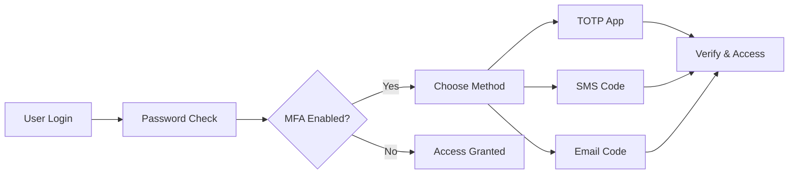

# Enable Multi-Factor Authentication

Add an extra layer of security to user accounts. MFA reduces account takeover risk by 99.9% and is required for SOC 2 compliance.


## What is Multi-Factor Authentication?

MFA requires users to provide **two or more verification factors**:

- **Something they know** — Password or PIN
- **Something they have** — Phone, authenticator app, or email access
- **Something they are** — Biometric data (future support)

This prevents unauthorized access even if passwords are compromised.

<Tip>
**Compliance requirement**: Many enterprise customers require MFA for security certifications like SOC 2 and ISO 27001.
</Tip>

## Supported MFA Methods

Protekt supports multiple authentication factors:



**Method comparison:**
- **TOTP (recommended)** — Offline, secure, works with Google Authenticator
- **SMS** — Convenient but vulnerable to SIM swapping
- **Email** — Good backup option, less secure than TOTP

## Step 1: Enable MFA in Dashboard

Configure which MFA methods your users can choose.

<CodeGroup>
```javascript Dashboard API
const mfaConfig = await protekt.mfa.configure({
  methods: {
    totp: { enabled: true, required: false },
    sms: { enabled: true, required: false },
    email: { enabled: true, required: false }
  },
  policy: {
    enforceForRoles: ["admin", "owner"],
    gracePeriod: "7d", // Users have 7 days to set up
    backupCodes: true
  }
});
```

```bash Dashboard Settings
# In Protekt Dashboard
1. Go to Security → MFA Settings
2. Enable TOTP, SMS, Email
3. Set enforcement policy
4. Save configuration
```
</CodeGroup>

<Warning>
**Start with optional MFA** to avoid locking out existing users. Gradually enforce for sensitive roles.
</Warning>

## Step 2: TOTP Setup (Recommended)

Let users set up authenticator apps like Google Authenticator or Authy.

<CodeGroup>
```javascript TOTP Enrollment
// Generate QR code for user
const setupTOTP = async () => {
  const totpSetup = await protekt.mfa.setupTOTP();
  
  // Display QR code and backup codes
  return {
    qrCodeUrl: totpSetup.qrCode,
    secret: totpSetup.secret,
    backupCodes: totpSetup.backupCodes
  };
};

// Verify TOTP code
const verifyTOTP = async (code) => {
  const result = await protekt.mfa.verifyTOTP({
    code: code,
    setupToken: totpSetup.token
  });
  
  if (result.success) {
    console.log("TOTP enabled successfully");
  }
};
```

```jsx React MFA Setup Component
const TOTPSetup = () => {
  const [qrCode, setQrCode] = useState('');
  const [verifyCode, setVerifyCode] = useState('');
  
  const startSetup = async () => {
    const setup = await protekt.mfa.setupTOTP();
    setQrCode(setup.qrCode);
  };
  
  return (
    <div>
      <h3>Set up Authenticator App</h3>
      {qrCode && }
      <input 
        placeholder="Enter 6-digit code"
        value={verifyCode}
        onChange={(e) => setVerifyCode(e.target.value)}
      />
      <button onClick={() => verifyTOTP(verifyCode)}>
        Verify & Enable
      </button>
    </div>
  );
};
```
</CodeGroup>

**User flow:** Show QR code → User scans with app → User enters generated code → MFA activated.

## Step 3: SMS & Email MFA

Configure phone and email-based verification.

<CodeGroup>
```javascript SMS MFA Setup
// Enable SMS MFA for user
const setupSMS = async (phoneNumber) => {
  const smsSetup = await protekt.mfa.setupSMS({
    phoneNumber: phoneNumber,
    countryCode: "+1"
  });
  
  // Send verification code
  await protekt.mfa.sendSMSCode();
  return smsSetup;
};

// Verify SMS code
const verifySMS = async (code) => {
  const result = await protekt.mfa.verifySMS({ code });
  if (result.success) {
    console.log("SMS MFA enabled");
  }
};
```

```javascript Email MFA Setup
// Email MFA (good backup method)
const setupEmailMFA = async () => {
  await protekt.mfa.setupEmail({
    email: user.email // Uses user's primary email
  });
  
  // Send test code
  await protekt.mfa.sendEmailCode();
};

const verifyEmailMFA = async (code) => {
  const result = await protekt.mfa.verifyEmail({ code });
  return result.success;
};
```
</CodeGroup>


## Step 4: Login Flow with MFA

Handle the two-step verification process during login.

<CodeGroup>
```javascript MFA Login Flow
const loginWithMFA = async (email, password) => {
  // Step 1: Regular login
  const loginResult = await protekt.auth.login({ email, password });
  
  if (loginResult.mfaRequired) {
    // Step 2: Show MFA challenge
    const availableMethods = loginResult.mfaMethods;
    return {
      needsMFA: true,
      methods: availableMethods, // ["totp", "sms", "email"]
      loginToken: loginResult.token
    };
  }
  
  // No MFA required, user is logged in
  return { needsMFA: false, user: loginResult.user };
};

// Verify MFA during login
const completeMFALogin = async (method, code, loginToken) => {
  const result = await protekt.auth.verifyMFA({
    method: method, // "totp", "sms", or "email"
    code: code,
    loginToken: loginToken
  });
  
  if (result.success) {
    // User is now fully authenticated
    return result.user;
  }
};
```

```jsx React Login with MFA
const LoginForm = () => {
  const [step, setStep] = useState('login'); // 'login' or 'mfa'
  const [mfaMethod, setMfaMethod] = useState('totp');
  const [mfaCode, setMfaCode] = useState('');
  
  const handleLogin = async (email, password) => {
    const result = await loginWithMFA(email, password);
    
    if (result.needsMFA) {
      setStep('mfa');
    } else {
      // Login complete
      router.push('/dashboard');
    }
  };
  
  if (step === 'mfa') {
    return (
      <div>
        <h3>Enter verification code</h3>
        <select value={mfaMethod} onChange={(e) => setMfaMethod(e.target.value)}>
          <option value="totp">Authenticator App</option>
          <option value="sms">Text Message</option>
          <option value="email">Email</option>
        </select>
        <input 
          placeholder="6-digit code"
          value={mfaCode}
          onChange={(e) => setMfaCode(e.target.value)}
        />
        <button onClick={() => completeMFALogin(mfaMethod, mfaCode, loginToken)}>
          Verify
        </button>
      </div>
    );
  }
  
  return /* regular login form */;
};
```
</CodeGroup>

## Step 5: Recovery Codes & Backup

Provide backup access when primary MFA methods fail.

<CodeGroup>
```javascript Backup Codes
// Generate recovery codes during MFA setup
const generateBackupCodes = async () => {
  const codes = await protekt.mfa.generateBackupCodes();
  
  // Show codes to user (download/print)
  return codes; // ["abc123", "def456", "ghi789", ...]
};

// Use recovery code for login
const useRecoveryCode = async (code, loginToken) => {
  const result = await protekt.auth.useRecoveryCode({
    code: code,
    loginToken: loginToken
  });
  
  if (result.success) {
    console.log(`${result.remainingCodes} recovery codes left`);
  }
  
  return result;
};
```
</CodeGroup>

**Recovery best practices:**
- Generate 10 single-use codes
- Prompt user to download/print them
- Show remaining code count
- Auto-generate new codes when running low

## Step 6: Enforce MFA Policies

Require MFA for specific roles or sensitive actions.

<CodeGroup>
```javascript MFA Enforcement
// Enforce MFA for admin roles
const enforceMFAPolicy = async () => {
  await protekt.mfa.setPolicy({
    enforceForRoles: ["admin", "owner"],
    enforceForActions: ["delete_user", "export_data"],
    gracePeriod: "7d",
    exemptUsers: [] // Emergency access list
  });
};

// Check if user needs MFA setup
const checkMFAStatus = async (userId) => {
  const status = await protekt.mfa.getUserStatus(userId);
  
  return {
    hasSetup: status.methods.length > 0,
    isRequired: status.required,
    gracePeriodEnds: status.gracePeriodEnds
  };
};
```

```javascript Middleware Protection
// Protect sensitive endpoints
app.delete('/api/users/:id', 
  protekt.requireAuth(),
  protekt.requireMFA(), // Must have completed MFA
  async (req, res) => {
    // Delete user logic
    res.json({ success: true });
  }
);
```
</CodeGroup>

## UX Best Practices

**Setup experience:**
- Make MFA optional initially
- Show clear benefits ("Protect your account")
- Provide multiple method options
- Generate and display backup codes

**Login experience:**
- Remember trusted devices for 30 days
- Show method icons (SMS, email, authenticator)
- Provide "Use backup code" option
- Clear error messages

<Tip>
**Trust but verify**: Let users mark devices as trusted, but re-prompt for sensitive actions like changing passwords.
</Tip>

## Testing MFA Integration

Verify your MFA implementation works correctly:

<CodeGroup>
```bash Test Commands
# Test TOTP setup
curl -X POST https://api.protekt.com/mfa/totp/setup \
  -H "Authorization: Bearer $TOKEN"

# Test SMS verification
curl -X POST https://api.protekt.com/mfa/sms/verify \
  -H "Authorization: Bearer $TOKEN" \
  -d '{"code": "123456"}'
```
</CodeGroup>

**Testing checklist:**
1. Set up each MFA method
2. Test login flow with MFA
3. Try recovery codes
4. Test enforcement policies
5. Verify backup code generation

## Next Steps

You've implemented comprehensive multi-factor authentication with TOTP, SMS, and email verification. Your users' accounts are now significantly more secure with multiple verification options and recovery mechanisms.

<CardGroup cols={2}>
<Card title="Security Best Practices" icon="shield-check" href="/security/best-practices">
Advanced security patterns and monitoring
</Card>
<Card title="Session Management" icon="clock" href="/how-to-guides/session-management">
Smart session handling with MFA
</Card>
<Card title="Enterprise SSO" icon="building" href="/how-to-guides/implement-sso">
Combine MFA with single sign-on
</Card>
<Card title="API Reference" icon="code" href="/reference/mfa">
Complete MFA API documentation
</Card>
</CardGroup>