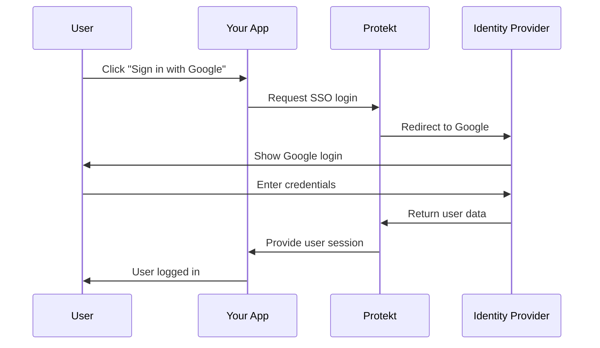

Let users sign in with their existing work accounts. SSO increases enterprise conversion by 70% and reduces support tickets by 45%.


## What is SSO?

SSO allows users to authenticate using their existing accounts from identity providers like Google Workspace, Microsoft Azure AD, or Okta. Users click one button and they're logged in.

**Benefits for users:**
- **No new passwords** — Use existing work credentials
- **Faster login** — One-click authentication
- **Better security** — Centralized access control

**Benefits for you:**
- **Higher enterprise sales** — Required for B2B customers
- **Reduced support** — No password reset tickets
- **Better compliance** — Enterprise-grade security

<Tip>
**Enterprise requirement**: 89% of B2B SaaS deals require SSO integration for security and compliance.
</Tip>

## SSO Authentication Flow

Here's how SSO works with your application:



<Tip>**Key insight**: Users never enter credentials in your app, everything happens through their trusted identity provider.</Tip>

## Step 1: Configure SSO Provider

Set up the connection between Protekt and your chosen identity provider. This creates the trust relationship needed for secure authentication.

<CodeGroup>
```javascript Configure Google SSO
const googleSSO = await protekt.sso.configure({
  provider: 'google',
  name: 'Acme Corp Google',
  config: {
    domain: 'acme.com', // Auto-assign users from this domain
    clientId: process.env.GOOGLE_CLIENT_ID,
    clientSecret: process.env.GOOGLE_CLIENT_SECRET,
    redirectUrl: 'https://yourapp.com/auth/callback'
  },
  organizationId: 'org_acme_123', // Link to specific organization
  autoProvisioning: true // Create users automatically
});
```

```javascript Configure Microsoft/Okta
// Microsoft Azure AD
const microsoftSSO = await protekt.sso.configure({
  provider: 'microsoft',
  name: 'Acme Corp Office 365',
  config: {
    tenantId: process.env.AZURE_TENANT_ID,
    clientId: process.env.AZURE_CLIENT_ID,
    clientSecret: process.env.AZURE_CLIENT_SECRET,
    domain: 'acme.com'
  }
});

// Okta
const oktaSSO = await protekt.sso.configure({
  provider: 'okta',
  name: 'Acme Corp Okta',
  config: {
    domain: 'acme.okta.com',
    clientId: process.env.OKTA_CLIENT_ID,
    clientSecret: process.env.OKTA_CLIENT_SECRET
  }
});
```
</CodeGroup>

<Warning>
**Security note**: Store all client secrets in environment variables, never in your code. Treat them like passwords.
</Warning>

## Step 2: Add SSO Login Buttons

Create the frontend interface that lets users choose their SSO provider. This is usually the first thing users see when logging in.

<CodeGroup>
```jsx React SSO Login
import { useProtekt } from '@protekt/react';

const SSOLogin = () => {
  const { loginWithSSO } = useProtekt();
  
  const handleSSOLogin = async (provider) => {
    try {
      // Redirects to SSO provider
      await loginWithSSO({
        provider: provider,
        redirectUrl: '/dashboard'
      });
    } catch (error) {
      console.error('SSO login failed:', error);
    }
  };
  
  return (
    <div className="sso-login">
      <h2>Sign in to your account</h2>
      
      <button 
        onClick={() => handleSSOLogin('google')}
        className="sso-button google"
      >
        
        Continue with Google
      </button>
      
      <button 
        onClick={() => handleSSOLogin('microsoft')}
        className="sso-button microsoft"  
      >
        
        Continue with Microsoft
      </button>
      
      <button 
        onClick={() => handleSSOLogin('okta')}
        className="sso-button okta"
      >
        
        Continue with Okta
      </button>
    </div>
  );
};
```
</CodeGroup>

**UX tip**: Show your company's SSO providers first, then generic options like Google.


## Step 3: Handle SSO Callback

Process the response when users return from the SSO provider. This completes the authentication and creates their session.

<CodeGroup>
```javascript SSO Callback Handler
// Handle the callback from SSO provider
const handleSSOCallback = async () => {
  const urlParams = new URLSearchParams(window.location.search);
  const code = urlParams.get('code');
  const state = urlParams.get('state');
  
  if (!code) {
    throw new Error('SSO authentication failed');
  }
  
  try {
    const result = await protekt.sso.exchangeCode({
      code: code,
      state: state
    });
    
    if (result.success) {
      // Store the session
      localStorage.setItem('auth_token', result.accessToken);
      
      // Redirect to dashboard
      window.location.href = '/dashboard';
    }
  } catch (error) {
    console.error('SSO callback failed:', error);
    window.location.href = '/login?error=sso_failed';
  }
};

// Call this on your callback page
useEffect(() => {
  handleSSOCallback();
}, []);
```

```javascript Next.js Callback Route
// pages/api/auth/sso/callback.js
export default async function handler(req, res) {
  const { code, state } = req.query;
  
  try {
    const result = await protekt.sso.exchangeCode({
      code,
      state,
      ipAddress: req.ip
    });
    
    if (result.success) {
      // Set secure session cookie
      res.setHeader('Set-Cookie', [
        `session=${result.sessionToken}; HttpOnly; Secure; Path=/`
      ]);
      
      res.redirect('/dashboard');
    }
  } catch (error) {
    console.error('SSO callback error:', error);
    res.redirect('/login?error=sso_failed');
  }
}
```
</CodeGroup>

## Step 4: Organization Mapping

Connect SSO users to the right organization in your app. This ensures users land in their company's workspace automatically.

<CodeGroup>
```javascript Auto-Organization Assignment
const mapSSOUserToOrg = async (ssoUser) => {
  // Extract domain from email
  const domain = ssoUser.email.split('@')[1];
  
  // Find organization by domain
  const organization = await protekt.organizations.findByDomain(domain);
  
  if (organization) {
    // Add user to organization with default role
    await protekt.organizations.addMember({
      orgId: organization.id,
      userId: ssoUser.id,
      role: 'member' // Default role for SSO users
    });
    
    return organization;
  } else {
    // Create new organization for this domain
    const newOrg = await protekt.organizations.create({
      name: `${domain} Organization`,
      domain: domain,
      ownerId: ssoUser.id
    });
    
    return newOrg;
  }
};
```
</CodeGroup>

**Best practice**: Always map users to organizations based on their email domain for automatic workspace assignment.

## Step 5: Test SSO Integration

Verify your SSO implementation works correctly across different providers and scenarios.

<CodeGroup>
```bash Test SSO Flow
# Test SSO configuration
curl -X GET https://api.protekt.com/sso/providers \
  -H "Authorization: Bearer $API_KEY"

# Test SSO metadata endpoint
curl -X GET https://api.protekt.com/sso/metadata/google \
  -H "Authorization: Bearer $API_KEY"
```

```javascript Integration Testing
const testSSOFlow = async () => {
  // Test 1: SSO provider configuration
  const providers = await protekt.sso.getProviders();
  console.assert(providers.length > 0, 'Should have SSO providers');
  
  // Test 2: SSO login URL generation
  const loginUrl = await protekt.sso.getLoginUrl({
    provider: 'google',
    redirectUrl: '/dashboard'
  });
  console.assert(loginUrl.includes('google.com'), 'Should generate Google login URL');
  
  // Test 3: Organization mapping
  const testUser = { email: 'test@acme.com', id: 'user_123' };
  const org = await mapSSOUserToOrg(testUser);
  console.assert(org.domain === 'acme.com', 'Should map to correct organization');
};
```
</CodeGroup>

**Testing checklist:**
1. Configure SSO providers in Protekt dashboard
2. Test login flow with each provider
3. Verify organization mapping works
4. Test callback URL handling
5. Confirm user session creation

## Enterprise Features

<CodeGroup>
```javascript Advanced SSO Configuration
// Just-in-Time (JIT) provisioning
const jitProvisioning = await protekt.sso.configure({
  provider: 'okta',
  jit: {
    enabled: true,
    defaultRole: 'member',
    attributeMapping: {
      firstName: 'given_name',
      lastName: 'family_name',
      department: 'department'
    }
  }
});

// SCIM provisioning for automatic user management
const scimConfig = await protekt.organizations.enableSCIM({
  orgId: 'org_acme_123',
  endpoint: 'https://yourapp.com/scim/v2',
  token: process.env.SCIM_TOKEN
});
```
</CodeGroup>

**Enterprise patterns:**
- **JIT Provisioning** — Create users automatically on first login
- **SCIM Integration** — Sync user changes from identity provider
- **Custom Attributes** — Map additional user data from SSO provider

## Common Issues & Solutions

**Callback URL mismatch**: Ensure your redirect URLs match exactly in both Protekt and your SSO provider.

**Domain verification**: Some providers require domain ownership verification before SSO works.

**Email conflicts**: Handle cases where users exist with different authentication methods.

<Tip>
**Production tip**: Always test SSO with real provider accounts, not just mock data. Each provider has unique quirks.
</Tip>

## Next Steps

You've implemented enterprise-grade SSO with multiple identity providers, automatic organization mapping, and secure session handling. Your app is now ready for enterprise customers who require SSO authentication.

<CardGroup cols={2}>
<Card title="B2B Organizations" icon="building" href="/tutorials/b2b-organizations">
Advanced organization management with SSO
</Card>
<Card title="Role-Based Access" icon="users-gear" href="/how-to-guides/setup-rbac">
Combine SSO with granular permissions
</Card>
<Card title="Security Best Practices" icon="shield-check" href="/security/best-practices">
Enterprise security and compliance
</Card>
<Card title="API Reference" icon="code" href="/reference/sso">
Complete SSO API documentation
</Card>
</CardGroup>