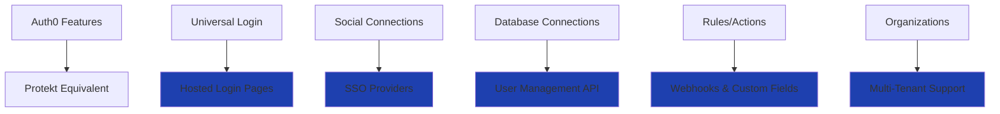

# Migrating from Auth0

Switch to Protekt for better developer experience and lower costs. Migration takes 2-4 hours with zero user disruption.


## Why Switch to Protekt?

Auth0 is powerful but complex and expensive. Protekt provides the same enterprise features with simpler implementation.

**Key advantages:**
- **60% lower costs** — No per-user pricing surprises
- **Faster integration** — 15-minute setup vs hours of config
- **Better support** — Direct access to engineering team
- **Predictable billing** — Flat-rate pricing model

<Tip>
**Zero downtime**: Users keep existing passwords and sessions during migration. No re-authentication required.
</Tip>

## Feature Comparison

Protekt matches Auth0's core features with cleaner implementation:



**Migration mapping:**
- **Auth0 Rules** → **Protekt Webhooks** (cleaner, more reliable)
- **Auth0 Actions** → **Protekt Custom Fields** (simpler data handling)
- **Auth0 Organizations** → **Protekt Organizations** (feature parity)

## Step 1: Export Your Auth0 Data

Extract users, organizations, and configuration from your Auth0 tenant. This preserves all existing user accounts and settings.

<CodeGroup>
```bash Export Users via CLI
# Install Auth0 CLI
npm install -g auth0-cli

# Login and export users
auth0 login
auth0 users export --format json --output users.json
auth0 orgs export --format json --output orgs.json
```

```javascript Export via Management API
const { ManagementClient } = require('auth0');

const management = new ManagementClient({
  domain: process.env.AUTH0_DOMAIN,
  clientId: process.env.AUTH0_CLIENT_ID,
  clientSecret: process.env.AUTH0_CLIENT_SECRET
});

const exportUsers = async () => {
  const users = await management.getUsers({
    per_page: 100,
    include_totals: true
  });
  
  require('fs').writeFileSync(
    'users-export.json', 
    JSON.stringify(users, null, 2)
  );
  
  console.log(`Exported ${users.length} users`);
};
```
</CodeGroup>

**Data includes**: User profiles, email addresses, metadata, organization memberships, and last login timestamps.

## Step 2: Import Users to Protekt

Transfer users to Protekt while preserving passwords and account data. Users won't need to reset passwords or verify emails.

<CodeGroup>
```javascript Basic Import
const importUsers = async () => {
  const auth0Users = JSON.parse(
    require('fs').readFileSync('users.json', 'utf8')
  );
  
  const result = await protekt.users.bulkImport({
    users: auth0Users.map(user => ({
      id: user.user_id,
      email: user.email,
      name: user.name,
      passwordHash: user.password,
      emailVerified: user.email_verified,
      metadata: {
        auth0_migrated: true,
        ...user.user_metadata
      }
    })),
    preservePasswords: true,
    sendWelcomeEmail: false
  });
  
  return result;
};
```

```javascript Import Organizations
const importOrganizations = async () => {
  const orgs = JSON.parse(
    require('fs').readFileSync('orgs.json', 'utf8')
  );
  
  for (const org of orgs) {
    await protekt.organizations.create({
      name: org.display_name,
      domain: org.branding?.primary_domain,
      metadata: {
        auth0_id: org.id,
        migrated_at: new Date().toISOString()
      }
    });
  }
};
```
</CodeGroup>

<Warning>
**Test first**: Always run migration on staging environment before touching production data.
</Warning>

## Step 3: Update Application Code

Replace Auth0 SDK calls with Protekt equivalents. The patterns are similar, making this straightforward.

<CodeGroup>
```jsx Frontend Migration
// OLD - Auth0 React
import { useAuth0 } from '@auth0/auth0-react';

const { loginWithRedirect, logout, user } = useAuth0();

// NEW - Protekt React  
import { useProtekt } from '@protekt/react';

const { login, logout, user } = useProtekt();
```

```javascript Backend Migration
// OLD - Auth0 middleware
const jwt = require('express-jwt');
const jwks = require('jwks-rsa');

const checkAuth = jwt({
  secret: jwks.expressJwtSecret({
    jwksUri: `https://${process.env.AUTH0_DOMAIN}/.well-known/jwks.json`
  })
});

// NEW - Protekt middleware
const { requireAuth } = require('@protekt/node');

const checkAuth = requireAuth({
  clientSecret: process.env.PROTEKT_SECRET
});
```
</CodeGroup>

**Key changes**: Function names are nearly identical. Main difference is initialization and configuration.

## Step 4: Update Environment Variables

Swap Auth0 configuration for Protekt credentials. Usually just a few environment variables.

<CodeGroup>
```bash Environment Variables
# Remove these Auth0 variables
# AUTH0_DOMAIN=your-tenant.auth0.com
# AUTH0_CLIENT_ID=abc123
# AUTH0_CLIENT_SECRET=xyz789

# Add these Protekt variables
PROTEKT_CLIENT_ID=pk_live_abc123
PROTEKT_CLIENT_SECRET=sk_live_xyz789
PROTEKT_API_URL=https://api.protekt.com
```

```javascript Config Updates
// OLD - Auth0 config
const auth0Config = {
  domain: process.env.AUTH0_DOMAIN,
  clientId: process.env.AUTH0_CLIENT_ID,
  redirectUri: window.location.origin
};

// NEW - Protekt config
const protektConfig = {
  clientId: process.env.PROTEKT_CLIENT_ID,
  redirectUri: window.location.origin
};
```
</CodeGroup>

## Step 5: Test & Go Live

Verify everything works before switching DNS or going live. Test all critical user flows.


<CodeGroup>
```javascript Migration Tests
const testMigration = async () => {
  // Test existing user login
  const loginResult = await protekt.auth.login({
    email: 'existing@example.com',
    password: 'existing-password'
  });
  
  console.assert(loginResult.success, 'Login failed');
  
  // Test SSO configuration
  const ssoProviders = await protekt.sso.getProviders();
  console.assert(ssoProviders.length > 0, 'No SSO providers');
  
  console.log('Migration test complete ✓');
};
```
</CodeGroup>

**Go-live checklist:**
- All users imported successfully
- Login flows work with existing passwords  
- SSO providers configured and tested
- Organizations and memberships preserved
- API endpoints respond correctly

## Common Issues & Solutions

<Tabs>
<Tab title="Password Hashing">
Protekt handles Auth0 password format automatically during import. No manual conversion needed.
</Tab>

<Tab title="Custom Domains">
Update CNAME records to point to Protekt's auth servers. DNS changes take 24-48 hours to propagate.
</Tab>

<Tab title="Rate Limits">
Protekt has more generous rate limiting than Auth0. Your apps will likely see better performance.
</Tab>

<Tab title="Webhooks">
Replace Auth0 Rules with Protekt webhooks for custom logic. Similar functionality, cleaner implementation.
</Tab>
</Tabs>

<Tip>
**Gradual rollout**: Consider migrating users in batches or using feature flags for gradual deployment.
</Tip>

## Post-Migration Cleanup

Clean up Auth0 dependencies and configuration after confirming everything works.

<CodeGroup>
```bash Remove Dependencies
# Uninstall Auth0 packages
npm uninstall @auth0/auth0-react @auth0/auth0-spa-js

# Install Protekt packages
npm install @protekt/react @protekt/node

# Clean up config files
rm -rf auth0-config.json .auth0
```

```javascript Update CI/CD
// Remove AUTH0_* environment variables from:
// - .env files
// - CI/CD pipeline configs
// - Docker configurations
// - Kubernetes secrets

// Add PROTEKT_* variables to same locations
```
</CodeGroup>

**Final cleanup steps:**
- Delete Auth0 tenant (after confirming everything works)
- Update team documentation and runbooks  
- Train team on Protekt dashboard usage
- Set up monitoring for new auth endpoints

## Success! What's Next?

You've successfully migrated from Auth0 to Protekt. Your auth infrastructure is now more cost-effective and developer-friendly.

<CardGroup cols={2}>
<Card title="Security Best Practices" icon="shield-check" href="/security/best-practices">
Optimize your new setup for security
</Card>
<Card title="Advanced Features" icon="settings" href="/how-to-guides/setup-rbac">
Add RBAC and advanced permissions
</Card>
<Card title="Troubleshooting" icon="wrench" href="/troubleshooting/common-errors">
Common migration issues and fixes
</Card>
<Card title="Migration Support" icon="life-buoy" href="/support">
Get help from our engineering team
</Card>
</CardGroup>