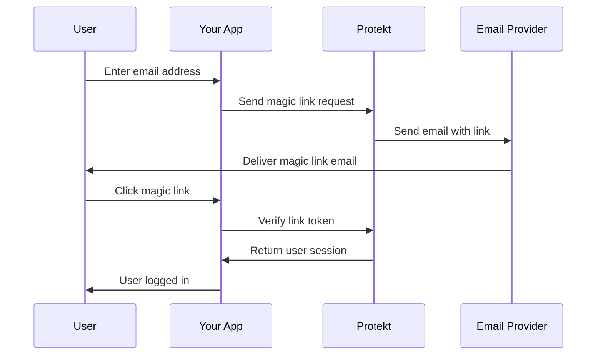

# Implement Magic Link Login

Eliminate passwords entirely. Magic links provide frictionless authentication that users love and reduces support tickets by 60%.


## What is a Magic Link?

Magic links are **secure, time-limited URLs** sent to users' email addresses. One click logs them in without typing passwords.

**Benefits:**
- **Zero passwords** — No forgotten credentials
- **Higher conversion** — 40% better signup rates
- **Mobile-friendly** — Perfect for phone users
- **Secure by default** — Each link is single-use and expires

<Tip>
**Perfect for onboarding**: Magic links remove friction from user signup flows, especially on mobile devices.
</Tip>

## How Magic Links Work

Here's the complete authentication flow:



**Security features:**
- Links expire in 15 minutes
- Single-use only (can't be reused)
- Tied to specific email address
- Optional IP address validation

## Step 1: Request Magic Link

Create the email input form and trigger the magic link email.

<CodeGroup>
```javascript Magic Link Request
const sendMagicLink = async (email) => {
  try {
    const result = await protekt.auth.sendMagicLink({
      email: email,
      redirectUrl: `${window.location.origin}/auth/verify`,
      expiresIn: '15m', // 15 minutes
      metadata: {
        source: 'login_form',
        userAgent: navigator.userAgent
      }
    });
    
    console.log('Magic link sent successfully');
    return result;
  } catch (error) {
    console.error('Failed to send magic link:', error);
    throw error;
  }
};
```

```jsx React Magic Link Form
const MagicLinkForm = () => {
  const [email, setEmail] = useState('');
  const [isLoading, setIsLoading] = useState(false);
  const [emailSent, setEmailSent] = useState(false);
  
  const handleSubmit = async (e) => {
    e.preventDefault();
    setIsLoading(true);
    
    try {
      await sendMagicLink(email);
      setEmailSent(true);
    } catch (error) {
      alert('Failed to send magic link');
    } finally {
      setIsLoading(false);
    }
  };
  
  if (emailSent) {
    return (
      <div className="text-center">
        <h3>Check your email</h3>
        <p>We sent a login link to {email}</p>
        <small>Link expires in 15 minutes</small>
      </div>
    );
  }
  
  return (
    <form onSubmit={handleSubmit}>
      <input
        type="email"
        placeholder="Enter your email"
        value={email}
        onChange={(e) => setEmail(e.target.value)}
        required
      />
      <button type="submit" disabled={isLoading}>
        {isLoading ? 'Sending...' : 'Send Magic Link'}
      </button>
    </form>
  );
};
```
</CodeGroup>

<Info>**UX tip**: Show a confirmation screen immediately so users know to check their email.</Info>

## Step 2: Customize Email Template

Create branded, professional-looking magic link emails.

<CodeGroup>
```javascript Email Template Config
const customizeEmailTemplate = async () => {
  await protekt.emails.updateTemplate('magic-link', {
    subject: 'Sign in to {{app_name}}',
    branding: {
      logo: 'https://yourapp.com/logo.png',
      primaryColor: '#6366f1',
      companyName: 'Your App'
    },
    content: {
      headline: 'Sign in to your account',
      buttonText: 'Sign In Securely',
      footerText: 'This link expires in 15 minutes and can only be used once.',
      supportEmail: 'help@yourapp.com'
    }
  });
};
```

```html Email Template Preview
<!-- Auto-generated by Protekt -->
<div style="max-width: 600px; margin: 0 auto; font-family: Arial;">
  
  
  <h1>{{headline}}</h1>
  <p>Click the button below to sign in:</p>
  
  <a href="{{magic_link}}" 
     style="background: {{primary_color}}; color: white; padding: 12px 24px; text-decoration: none; border-radius: 6px;">
    {{button_text}}
  </a>
  
  <p><small>{{footer_text}}</small></p>
</div>
```
</CodeGroup>


## Step 3: Handle Magic Link Verification

Process the magic link when users click it from their email.

<CodeGroup>
```javascript Link Verification Handler
// Extract token from URL and verify
const handleMagicLinkCallback = async () => {
  const urlParams = new URLSearchParams(window.location.search);
  const token = urlParams.get('token');
  
  if (!token) {
    throw new Error('Invalid magic link - missing token');
  }
  
  try {
    const result = await protekt.auth.verifyMagicLink({ token });
    
    if (result.success) {
      // Store session and redirect
      localStorage.setItem('auth_token', result.accessToken);
      window.location.href = '/dashboard';
    }
  } catch (error) {
    console.error('Magic link verification failed:', error);
    
    if (error.code === 'EXPIRED_LINK') {
      showError('This link has expired. Please request a new one.');
    } else if (error.code === 'USED_LINK') {
      showError('This link has already been used.');
    } else {
      showError('Invalid magic link. Please try again.');
    }
  }
};
```

```javascript Next.js API Route
// pages/api/auth/verify.js
export default async function handler(req, res) {
  const { token } = req.query;
  
  try {
    const result = await protekt.auth.verifyMagicLink({ 
      token,
      ipAddress: req.ip, // Optional IP validation
      userAgent: req.headers['user-agent']
    });
    
    if (result.success) {
      // Set secure session cookie
      res.setHeader('Set-Cookie', [
        `session=${result.sessionToken}; HttpOnly; Secure; Path=/; Max-Age=86400`
      ]);
      
      res.redirect('/dashboard');
    }
  } catch (error) {
    res.redirect(`/login?error=${error.code}`);
  }
}
```
</CodeGroup>

**Error handling**: Always provide clear feedback for expired, used, or invalid links.

## Step 4: Advanced Security Options

Add extra security layers for sensitive applications.

<CodeGroup>
```javascript Security Enhancements
const sendSecureMagicLink = async (email) => {
  const result = await protekt.auth.sendMagicLink({
    email: email,
    security: {
      requireSameIP: true, // Must verify from same IP
      requireSameBrowser: true, // Browser fingerprinting
      maxAttempts: 3, // Limit verification attempts
      cooldownPeriod: '5m' // Wait 5min between sends
    },
    expiresIn: '10m' // Shorter expiry for high security
  });
  
  return result;
};

// Verify with additional checks
const secureVerification = async (token) => {
  const result = await protekt.auth.verifyMagicLink({
    token,
    security: {
      validateIP: true,
      validateBrowser: true,
      logAttempt: true // Audit trail
    }
  });
  
  return result;
};
```
</CodeGroup>

<Warning>
**Security trade-off**: Strict validation improves security but may frustrate users who switch devices or networks.
</Warning>

## Step 5: Mobile Deep Linking

Make magic links open your mobile app directly.

<CodeGroup>
```javascript Mobile Deep Links
const sendMobileOptimizedLink = async (email) => {
  const isMobile = /iPhone|iPad|iPod|Android/i.test(navigator.userAgent);
  
  const redirectUrl = isMobile 
    ? 'yourapp://auth/verify' // Custom URL scheme
    : `${window.location.origin}/auth/verify`;
  
  await protekt.auth.sendMagicLink({
    email: email,
    redirectUrl: redirectUrl,
    fallbackUrl: `${window.location.origin}/auth/verify` // Web fallback
  });
};
```

```javascript App URL Handling
// React Native deep link handler
import { Linking } from 'react-native';

const handleDeepLink = (url) => {
  const token = extractTokenFromUrl(url);
  
  if (token) {
    verifyMagicLink(token);
  }
};

// Listen for deep links
useEffect(() => {
  Linking.addEventListener('url', handleDeepLink);
  
  return () => {
    Linking.removeEventListener('url', handleDeepLink);
  };
}, []);
```
</CodeGroup>

## Step 6: Rate Limiting & Abuse Prevention

Prevent spam and abuse of your magic link system.

<CodeGroup>
```javascript Rate Limiting
const rateLimitedSend = async (email, userIP) => {
  // Check rate limits before sending
  const rateLimit = await protekt.auth.checkRateLimit({
    email: email,
    ip: userIP,
    action: 'magic_link_send'
  });
  
  if (rateLimit.exceeded) {
    throw new Error(`Too many attempts. Try again in ${rateLimit.resetIn} seconds.`);
  }
  
  return await protekt.auth.sendMagicLink({
    email: email,
    rateLimit: {
      maxPerEmail: 3, // 3 links per email per hour
      maxPerIP: 10, // 10 links per IP per hour
      windowMs: 3600000 // 1 hour window
    }
  });
};
```
</CodeGroup>

**Anti-abuse features:**
- 3 magic links max per email per hour
- 10 magic links max per IP per hour
- CAPTCHA after multiple failed attempts
- Automatic suspicious activity detection

## Testing Magic Links

Verify your implementation works across different scenarios.

<CodeGroup>
```bash Test Commands
# Test magic link generation
curl -X POST https://api.protekt.com/auth/magic-link \
  -H "Content-Type: application/json" \
  -d '{"email": "test@example.com"}'

# Test link verification
curl -X POST https://api.protekt.com/auth/verify-magic-link \
  -H "Content-Type: application/json" \
  -d '{"token": "ml_1234567890"}'
```

```javascript Integration Tests
const testMagicLinks = async () => {
  // Test 1: Valid email
  const result1 = await sendMagicLink('valid@example.com');
  console.assert(result1.success, 'Should send to valid email');
  
  // Test 2: Rate limiting
  try {
    for (let i = 0; i < 5; i++) {
      await sendMagicLink('test@example.com');
    }
    console.assert(false, 'Should be rate limited');
  } catch (error) {
    console.assert(error.code === 'RATE_LIMITED', 'Should hit rate limit');
  }
  
  // Test 3: Link expiry
  setTimeout(async () => {
    try {
      await verifyMagicLink('expired_token');
      console.assert(false, 'Should reject expired link');
    } catch (error) {
      console.assert(error.code === 'EXPIRED_LINK', 'Should be expired');
    }
  }, 16 * 60 * 1000); // 16 minutes later
};
```
</CodeGroup>

**Testing checklist:**
1. Send magic link to valid email
2. Verify link works within time limit  
3. Confirm link expires after 15 minutes
4. Test rate limiting behavior
5. Verify single-use enforcement

## Best Practices

**Email deliverability:**
- Set up SPF, DKIM, and DMARC records
- Use consistent "from" address
- Include unsubscribe link for compliance
- Monitor bounce rates

**User experience:**
- Show clear success/error states
- Provide "Resend link" button
- Display remaining time until expiry
- Handle email client preview issues

<Tip>
**Fallback strategy**: Always provide a "Having trouble?" link that offers alternative login methods like password or phone verification.
</Tip>

## Next Steps

You've implemented secure, user-friendly magic link authentication with custom branding, mobile support, and anti-abuse protection. Your users can now log in with just their email address.

<CardGroup cols={2}>
<Card title="Session Management" icon="clock" href="/how-to-guides/session-management">
Handle user sessions after magic link login
</Card>
<Card title="Email Templates" icon="envelope" href="/how-to-guides/customize-emails">
Advanced email customization options
</Card>
<Card title="Multi-Factor Auth" icon="shield" href="/how-to-guides/enable-mfa">
Add MFA as optional second factor
</Card>
<Card title="API Reference" icon="code" href="/reference/magic-links">
Complete magic links API documentation
</Card>
</CardGroup>