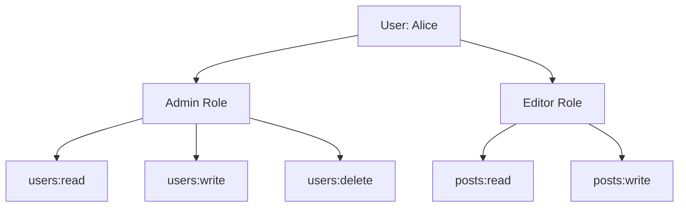

# Role-Based Access Control (RBAC)

Control exactly what users can do in your application. RBAC reduces security risks by 85% and simplifies permission management at scale.


## What is RBAC?

RBAC assigns **permissions** to **roles**, then assigns **roles** to **users**. Instead of managing individual user permissions, you control access through standardized roles.

**Key concepts:**
- **Permissions** — Specific actions (read, write, delete)
- **Roles** — Collections of permissions (admin, editor, viewer)
- **Users** — Assigned one or more roles

<Tip>
**Enterprise standard**: RBAC is required for SOC 2 compliance and enterprise security certifications.
</Tip>

## RBAC Flow

Here's how roles and permissions work together:



**Permission format**: `resource:action` (e.g., `users:read`, `posts:write`)

## Step 1: Define Permissions

Start by mapping what actions users can perform in your app. Think about your main features and what actions each feature needs.

<CodeGroup>
```javascript Create Permissions
const permissions = await protekt.rbac.definePermissions([
  // User management
  { name: 'users:read', description: 'View user profiles' },
  { name: 'users:write', description: 'Edit user details' },
  { name: 'users:delete', description: 'Delete user accounts' },
  
  // Content management  
  { name: 'posts:read', description: 'View posts' },
  { name: 'posts:write', description: 'Create and edit posts' },
  { name: 'posts:delete', description: 'Delete posts' },
  
  // Billing access
  { name: 'billing:read', description: 'View billing information' },
  { name: 'billing:write', description: 'Modify billing settings' }
]);
```
</CodeGroup>

**Best practice**: Use consistent naming like `resource:action` for easy management.

## Step 2: Create Roles

Build roles that combine logical permission sets. Start with 3-4 basic roles and expand as needed.

<CodeGroup>
```javascript Define Roles
const roles = await protekt.rbac.createRoles([
  {
    name: 'viewer',
    description: 'Read-only access to content',
    permissions: ['posts:read']
  },
  {
    name: 'editor', 
    description: 'Create and edit content',
    permissions: ['posts:read', 'posts:write']
  },
  {
    name: 'admin',
    description: 'Full management access',
    permissions: [
      'users:read', 'users:write', 'users:delete',
      'posts:read', 'posts:write', 'posts:delete',
      'billing:read'
    ]
  },
  {
    name: 'owner',
    description: 'Complete system access',
    permissions: '*' // All permissions
  }
]);
```
</CodeGroup>

## Step 3: Assign Roles to Users

Connect users to their appropriate roles based on their responsibilities in your application.

<CodeGroup>
```javascript Assign User Roles
// Assign single role
await protekt.rbac.assignRole({
  userId: 'user_alice_123',
  role: 'admin'
});

// Assign multiple roles
await protekt.rbac.assignRoles({
  userId: 'user_bob_456', 
  roles: ['editor', 'viewer']
});

// Auto-assign based on email domain
const assignRoleByEmail = async (user) => {
  const domain = user.email.split('@')[1];
  
  const role = domain === 'yourcompany.com' ? 'admin' : 'viewer';
  
  await protekt.rbac.assignRole({
    userId: user.id,
    role: role
  });
};
```
</CodeGroup>

<Warning>
**Start simple**: Begin with basic role assignments. You can always create more granular roles later.
</Warning>

## Step 4: Protect Frontend

Control what UI elements users can see based on their permissions. This improves UX and provides a first layer of security.

<CodeGroup>
```jsx React Permission Guards
import { useProtekt } from '@protekt/react';

const Dashboard = () => {
  const { hasPermission, hasRole } = useProtekt();
  
  return (
    <div>
      <h1>Dashboard</h1>
      
      {hasPermission('posts:write') && (
        <button>Create Post</button>
      )}
      
      {hasPermission('users:read') && (
        <UsersTable />
      )}
      
      {hasRole('admin') && (
        <AdminPanel />
      )}
    </div>
  );
};

// Protect entire routes
const ProtectedRoute = ({ permission, children }) => {
  const { hasPermission } = useProtekt();
  
  if (!hasPermission(permission)) {
    return <div>Access denied</div>;
  }
  
  return children;
};
```
</CodeGroup>


## Step 5: Secure Backend

Enforce permissions on your API routes. This is your critical security layer that prevents unauthorized access.

<CodeGroup>
```javascript Express Middleware
// Create permission middleware
const requirePermission = (permission) => {
  return async (req, res, next) => {
    const hasPermission = await protekt.rbac.checkPermission({
      userId: req.user.id,
      permission: permission
    });
    
    if (!hasPermission) {
      return res.status(403).json({
        error: 'Insufficient permissions',
        required: permission
      });
    }
    
    next();
  };
};

// Protect your endpoints
app.get('/api/users', 
  protekt.requireAuth(),
  requirePermission('users:read'),
  (req, res) => {
    res.json({ users: getUsersForOrg(req.user.orgId) });
  }
);

app.delete('/api/users/:id',
  protekt.requireAuth(), 
  requirePermission('users:delete'),
  (req, res) => {
    deleteUser(req.params.id);
    res.json({ success: true });
  }
);
```
</CodeGroup>

## Step 6: Test Your Implementation

Verify your permission system works correctly across different user roles.

<CodeGroup>
```bash Test RBAC
# Test admin permissions
curl -H "Authorization: Bearer $ADMIN_TOKEN" \
     https://api.yourapp.com/users

# Test viewer permissions (should fail)
curl -H "Authorization: Bearer $VIEWER_TOKEN" \
     -X DELETE https://api.yourapp.com/users/123
```
</CodeGroup>

**Testing checklist:**
1. Verify each role has correct permissions
2. Test UI elements show/hide properly  
3. Confirm API endpoints reject unauthorized requests
4. Test role assignment and removal

## Common RBAC Patterns

**SaaS Application**: Owner → Admin → Editor → Viewer
**Content Platform**: Publisher → Editor → Writer → Reader  
**E-commerce**: Store Owner → Manager → Staff → Customer

<Tip>
**Permission naming**: Use descriptive names like `billing:read` instead of cryptic codes. Keep it simple and consistent.
</Tip>

## Next Steps

You've built secure role-based access control with granular permissions and proper enforcement. Your app now has enterprise-grade authorization that protects sensitive actions and scales with your team.

<CardGroup cols={2}>
<Card title="B2B Organizations" icon="building" href="/tutorials/b2b-organizations">
Add organization-level RBAC for multi-tenant apps
</Card>
<Card title="Implement SSO" icon="key" href="/how-to-guides/implement-sso">
Integrate enterprise single sign-on with RBAC
</Card>
<Card title="Security Best Practices" icon="shield-check" href="/security/best-practices">
Advanced security patterns and audit logging
</Card>
<Card title="API Reference" icon="code" href="/reference/rbac">
Complete RBAC API documentation
</Card>
</CardGroup>