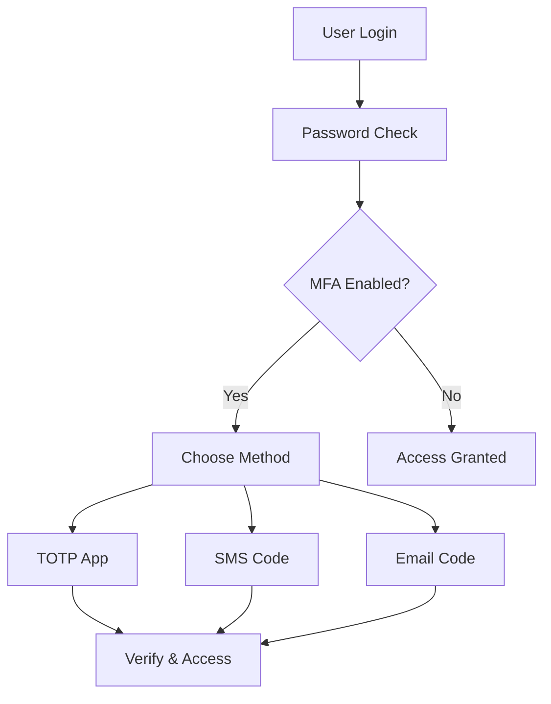

Multi-Factor Authentication (MFA) adds an extra layer of security and is required for compliance in many enterprises (SOC 2, ISO 27001). Protekt supports **[TOTP](/support/glossary#totp-time-based-one-time-password) apps, SMS, and Email codes**.

<Info>
  **Prerequisites**: Before you begin, sign up at [dashboard.protekt.com](https://dashboard.protekt.com) and ensure Node.js 16+ is installed.
</Info>

<Tip>
**Compliance requirement**: Many enterprise customers require MFA for security certifications like SOC 2 and ISO 27001.
</Tip>

## Supported MFA methods

Protekt supports multiple authentication factors so your users can choose what works best for them:

<Frame>

</Frame>
**Available methods:**
- **TOTP apps** - Google Authenticator, Authy, Microsoft Authenticator (most secure)
- **SMS codes** - Text message verification
- **Email codes** - Email-based verification
- **Recovery codes** - Backup codes for emergency access

## Step 1: Enable MFA in dashboard

Configure which MFA methods your users can choose from. We recommend starting with all three methods enabled so users have flexibility.

<CodeGroup>
```javascript Dashboard API
await protekt.mfa.configure({
  methods: { 
    totp: true,    // Authenticator apps
    sms: true,     // Text messages
    email: true    // Email codes
  },
  policy: { 
    enforceForRoles: ["admin"],  // Start with admins
    gracePeriod: "7d",           // Give users a week to set up
    maxAttempts: 5,              // Lock after 5 failed attempts
    rememberDevice: true         // Optional: reduce friction
  }
});
```

```bash Dashboard Settings
# In Protekt Dashboard
1. Go to Security → MFA Settings
2. Enable TOTP, SMS, Email
3. Set enforcement policy
4. Configure rate limits
5. Save configuration
```
</CodeGroup>

<Warning>
**Start with optional MFA** to avoid locking out existing users. Gradually enforce for sensitive roles (admins first), then expand to all users.
</Warning>

**Enforcement strategies:**
- **Immediate** - Required on next login (use for new apps)
- **Grace period** - Give users 7-14 days to set up
- **Role-based** - Enforce for admins first, then regular users
- **Optional** - Encourage but don't require

## Step 2: TOTP setup

TOTP (Time-based One-Time Password) is the most secure MFA method. Users scan a QR code with their authenticator app, which generates 6-digit codes that change every 30 seconds.

<CodeGroup>
```javascript TOTP Enrollment
// Generate TOTP secret and QR code
const setupTOTP = async (userId) => {
  const totpSetup = await protekt.mfa.setupTOTP({ userId });
  
  // Display to user
  return {
    qrCode: totpSetup.qrCode,     // Show as image
    secret: totpSetup.secret,      // Fallback for manual entry
    backupCodes: totpSetup.backupCodes
  };
};

// Verify user's first code
const verifyTOTPSetup = async (code, secret) => {
  const result = await protekt.mfa.verifyTOTP({ 
    code: code,
    secret: secret 
  });
  
  if (result.success) {
    console.log("TOTP enabled successfully!");
    // Store that user has MFA enabled
    await protekt.users.update({ mfaEnabled: true, mfaMethod: "totp" });
  } else {
    throw new Error(result.error || "Invalid code");
  }
  
  return result;
};
```

```javascript Frontend Example
// React component for TOTP setup
function TOTPSetup() {
  const [qrCode, setQRCode] = useState(null);
  const [code, setCode] = useState("");
  
  const startSetup = async () => {
    const setup = await setupTOTP(currentUser.id);
    setQRCode(setup.qrCode);
  };
  
  const verifyCode = async () => {
    try {
      await verifyTOTPSetup(code, secret);
      alert("MFA enabled! You're all set.");
    } catch (error) {
      alert("Invalid code. Please try again.");
    }
  };
  
  return (
    <div>
      <h2>Set up authenticator app</h2>
      
      <p>Scan with Google Authenticator, Authy, or similar</p>
      <input 
        value={code} 
        onChange={(e) => setCode(e.target.value)}
        placeholder="Enter 6-digit code"
      />
      <button onClick={verifyCode}>Verify & Enable</button>
    </div>
  );
}
```
</CodeGroup>

**User flow:**
1. User requests TOTP setup
2. Show QR code (and manual entry code as backup)
3. User scans with authenticator app
4. User enters the generated 6-digit code
5. Verify code and enable MFA
6. Show backup codes (important!)

<Tip>
**Recommended apps**: Google Authenticator, Authy, Microsoft Authenticator, or 1Password. All generate standard TOTP codes.
</Tip>

## Step 3: SMS & email MFA

Configure phone and email-based verification for users who prefer these methods. SMS is convenient but slightly less secure than TOTP.

<CodeGroup>
```javascript SMS Setup
// Enable SMS MFA for user
const setupSMS = async (phoneNumber) => {
  // Validate phone number format
  if (!phoneNumber.match(/^\+[1-9]\d{1,14}$/)) {
    throw new Error("Invalid phone format. Use E.164: +15551234567");
  }
  
  // Send verification code
  const result = await protekt.mfa.setupSMS({ 
    phoneNumber: phoneNumber 
  });
  
  console.log("SMS sent to", phoneNumber);
  return result.verificationId;
};

// Verify SMS code
const verifySMS = async (verificationId, code) => {
  const result = await protekt.mfa.verifySMS({
    verificationId: verificationId,
    code: code
  });
  
  if (result.success) {
    await protekt.users.update({ 
      mfaEnabled: true, 
      mfaMethod: "sms",
      phoneNumber: result.phoneNumber
    });
  }
  
  return result;
};
```

```javascript Email Setup
// Enable email MFA (usually auto-configured)
const setupEmail = async (email) => {
  const result = await protekt.mfa.setupEmail({ 
    email: email 
  });
  
  console.log("Verification email sent");
  return result.verificationId;
};

// Verify email code
const verifyEmail = async (verificationId, code) => {
  const result = await protekt.mfa.verifyEmail({
    verificationId: verificationId,
    code: code
  });
  
  if (result.success) {
    await protekt.users.update({ 
      mfaEnabled: true, 
      mfaMethod: "email" 
    });
  }
  
  return result;
};
```
</CodeGroup>

**SMS considerations:**
- Requires valid phone number in E.164 format: `+15551234567`
- Codes expire after 10 minutes
- Rate limited to prevent abuse (3 codes per hour)
- May incur SMS costs depending on your plan

**Email considerations:**
- Uses user's verified email address
- Codes expire after 15 minutes
- Good fallback when phone isn't available
- Check spam folder if not received

## Step 4: Login flow with MFA

Handle the two-step verification process during login. The flow is: credentials → MFA challenge → access granted.

<CodeGroup>
```javascript Complete Login Flow
const loginWithMFA = async (email, password) => {
  try {
    // Step 1: Verify credentials
    const login = await protekt.auth.login({ 
      email: email, 
      password: password 
    });
    
    // Step 2: Check if MFA required
    if (login.mfaRequired) {
      console.log("MFA required. Methods:", login.availableMethods);
      
      // Show MFA prompt to user
      const userChoice = await promptUserForMFAMethod(login.availableMethods);
      
      // Step 3: Get code based on method
      let code;
      if (userChoice === "totp") {
        code = await promptForTOTPCode();
      } else if (userChoice === "sms") {
        await protekt.mfa.sendSMSCode({ loginToken: login.token });
        code = await promptForSMSCode();
      } else if (userChoice === "email") {
        await protekt.mfa.sendEmailCode({ loginToken: login.token });
        code = await promptForEmailCode();
      }
      
      // Step 4: Verify MFA code
      const mfaResult = await protekt.auth.verifyMFA({
        method: userChoice,
        code: code,
        loginToken: login.token,
        rememberDevice: userWantsToRememberDevice // Optional
      });
      
      if (mfaResult.success) {
        // Store session token
        localStorage.setItem("authToken", mfaResult.sessionToken);
        return { success: true, user: mfaResult.user };
      } else {
        throw new Error(mfaResult.error || "MFA verification failed");
      }
    } else {
      // No MFA required
      localStorage.setItem("authToken", login.sessionToken);
      return { success: true, user: login.user };
    }
    
  } catch (error) {
    console.error("Login error:", error.message);
    
    // Handle specific errors
    if (error.code === "MAX_ATTEMPTS_EXCEEDED") {
      return { error: "Too many attempts. Try again in 15 minutes." };
    } else if (error.code === "CODE_EXPIRED") {
      return { error: "Code expired. Request a new one." };
    } else {
      return { error: "Login failed. Please try again." };
    }
  }
};
```

```javascript Error Handling
// Handle common MFA errors gracefully
const handleMFAError = (error) => {
  const errorMessages = {
    "INVALID_CODE": "Invalid code. Please check and try again.",
    "CODE_EXPIRED": "Code expired. Request a new one.",
    "MAX_ATTEMPTS_EXCEEDED": "Too many failed attempts. Wait 15 minutes.",
    "RATE_LIMIT": "Too many requests. Please wait a moment.",
    "DEVICE_NOT_TRUSTED": "This device isn't recognized. Check your email.",
    "MFA_NOT_SETUP": "MFA not configured. Set up MFA first."
  };
  
  return errorMessages[error.code] || "Something went wrong. Try again.";
};
```
</CodeGroup>

**Session behavior:**
- MFA verification creates a session token
- Sessions expire based on your configuration (default: 24 hours)
- "Remember this device" extends to 30 days
- Logging out invalidates all sessions

**Best practices:**
- Show remaining attempts (e.g., "2 attempts left")
- Offer "Use different method" option
- Clear error messages for each failure type
- Link to recovery codes if locked out

## Step 5: Recovery codes & backup

Recovery codes are critical for when users lose access to their primary MFA method. Generate them during setup and whenever requested.

<CodeGroup>
```javascript Generate Backup Codes
// Generate recovery codes during MFA setup
const generateBackupCodes = async (userId) => {
  const result = await protekt.mfa.generateBackupCodes({ 
    userId: userId,
    count: 10  // Generate 10 single-use codes
  });
  
  // Show codes to user (must download/print)
  console.log("Save these codes in a safe place:");
  result.codes.forEach((code, index) => {
    console.log(`${index + 1}. ${code}`);
  });
  
  return result.codes;
};

// Use recovery code for login
const useRecoveryCode = async (code, loginToken) => {
  const result = await protekt.auth.useRecoveryCode({
    code: code,
    loginToken: loginToken
  });
  
  if (result.success) {
    console.log(`Login successful. ${result.remainingCodes} codes remaining.`);
    
    // Warn if running low
    if (result.remainingCodes <= 2) {
      console.warn("⚠️ Only 2 recovery codes left. Generate new ones!");
    }
  }
  
  return result;
};

// Regenerate codes (invalidates old ones)
const regenerateBackupCodes = async (userId) => {
  const confirmed = await confirmAction(
    "This will invalidate all existing recovery codes. Continue?"
  );
  
  if (!confirmed) return;
  
  const newCodes = await protekt.mfa.regenerateBackupCodes({ userId });
  
  console.log("New recovery codes generated:");
  return newCodes;
};
```

```javascript Frontend Component
// React component for recovery codes
function RecoveryCodes({ codes }) {
  const downloadCodes = () => {
    const text = codes.map((code, i) => `${i + 1}. ${code}`).join('\n');
    const blob = new Blob([text], { type: 'text/plain' });
    const url = URL.createObjectURL(blob);
    const a = document.createElement('a');
    a.href = url;
    a.download = 'protekt-recovery-codes.txt';
    a.click();
  };
  
  const printCodes = () => {
    window.print();
  };
  
  return (
    <div className="recovery-codes">
      <h3>Save your recovery codes</h3>
      <p>
        These codes can be used to access your account if you lose your phone 
        or authenticator app. Each code works only once.
      </p>
      
      <div className="codes-list">
        {codes.map((code, i) => (
          <code key={i}>{code}</code>
        ))}
      </div>
      
      <div className="actions">
        <button onClick={downloadCodes}>Download</button>
        <button onClick={printCodes}>Print</button>
      </div>
      
      <Warning>
        Store these codes somewhere safe. Don't share them with anyone.
      </Warning>
    </div>
  );
}
```
</CodeGroup>

**Recovery best practices:**
- Generate 10 single-use codes per user
- Force user to download or print before continuing
- Show remaining code count after each use
- Auto-generate new codes when < 3 remain
- Allow users to regenerate codes anytime
- Store codes hashed (never plain text)

**User guidance:**
- "Save these codes in your password manager"
- "Print and store in a safe place"
- "Take a screenshot and store securely"
- "Don't share these codes with anyone"


## Security best practices

Implement these safeguards to protect your MFA system.

**Critical security practices:**
- Enforce MFA for admin/privileged accounts immediately
- Use TOTP over SMS when possible (more secure against SIM swaps)
- Log all MFA events (setup, verification, failures, recovery code usage)
- Set attempt limits (5 failed attempts = 15 minute lockout)
- Rate limit code generation (3 codes per hour max)
- Expire codes quickly (10 minutes for SMS/email, 30 seconds for TOTP)
- Hash recovery codes (never store plain text)
- Notify users of MFA changes via email


## Troubleshooting

Common MFA issues and how to fix them.

### "Invalid code" errors

**For TOTP:**
- Check device time sync (TOTP relies on accurate time)
  - iOS: Settings → General → Date & Time → Set Automatically
  - Android: Settings → System → Date & Time → Use network time
- Verify code hasn't expired (codes change every 30 seconds)
- Make sure you're using the right account in your authenticator app
- Try the next code if current one just changed

**For SMS/Email:**
- Codes expire after 10-15 minutes
- Request a new code if old one expired
- Check spam folder for emails
- Verify phone number is correct

### SMS not received

- Verify phone number format: `+15551234567` (E.164)
- Check SMS provider configuration in dashboard
- Review rate limits (max 3 codes per hour)
- Try email method as alternative
- Check carrier's spam filtering

### Locked out of account

**If you have recovery codes:**
1. Click "Use recovery code" on login screen
2. Enter one of your backup codes
3. Log in successfully
4. Generate new recovery codes immediately

**If you lost recovery codes:**
1. Contact support with account verification details
2. Support will verify your identity
3. MFA will be temporarily disabled
4. Set up MFA again with new codes

### Code always says "expired"

This usually means a time sync issue:
- **TOTP apps** need your device time to match server time
- Enable automatic time sync on your phone
- Check timezone is correct
- Restart your phone to force time sync

### "Too many attempts" error

You've exceeded the rate limit (5 attempts per 15 minutes). Wait 15 minutes and try again. If this keeps happening:
- Double-check you're entering codes correctly
- Verify time sync (for TOTP)
- Request fresh codes (for SMS/email)
- Use recovery code if available

## Testing MFA

Test your MFA implementation before going live.

<CodeGroup>
```javascript Test Mode
// Enable test mode in development
await protekt.mfa.configure({
  testMode: true,  // Accepts code "000000" in development
  methods: { totp: true, sms: true, email: true }
});

// Test TOTP setup flow
describe("TOTP Setup", () => {
  it("should generate valid QR code", async () => {
    const setup = await protekt.mfa.setupTOTP({ userId: testUser.id });
    expect(setup.qrCode).toBeDefined();
    expect(setup.secret).toMatch(/^[A-Z2-7]{32}$/);
  });
  
  it("should verify correct code", async () => {
    const result = await protekt.mfa.verifyTOTP({
      code: generateTestCode(secret),
      secret: secret
    });
    expect(result.success).toBe(true);
  });
});

// Test login with MFA
describe("Login Flow", () => {
  it("should require MFA for protected accounts", async () => {
    const login = await protekt.auth.login({ 
      email: "admin@example.com", 
      password: "test123" 
    });
    expect(login.mfaRequired).toBe(true);
  });
  
  it("should accept valid recovery code", async () => {
    const result = await protekt.auth.useRecoveryCode({
      code: testRecoveryCode,
      loginToken: testLoginToken
    });
    expect(result.success).toBe(true);
  });
});
```
</CodeGroup>

**Test checklist:**
- [ ] TOTP setup generates valid QR code
- [ ] Code verification works correctly
- [ ] Failed attempts trigger rate limiting
- [ ] Recovery codes work as expected
- [ ] SMS/Email codes are sent and received
- [ ] Codes expire after timeout
- [ ] "Remember device" persists correctly
- [ ] Audit logs capture all events


## Next steps

Now that you've implemented MFA:

1. **Monitor adoption**: Track how many users enable MFA
2. **Set enforcement timeline**: Plan gradual rollout
3. **Train your team**: Make sure support knows how to help users
4. **Test recovery flow**: Ensure locked-out users can regain access
5. **Review audit logs**: Watch for suspicious MFA activity
