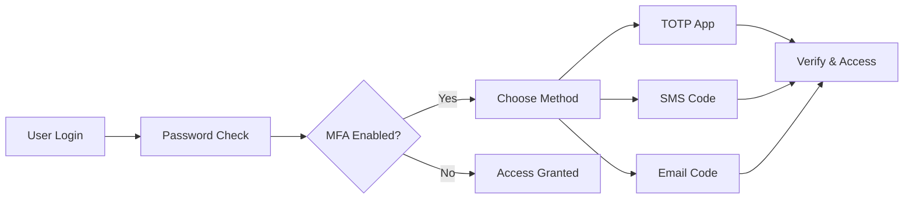

Multi-Factor Authentication (MFA) adds an extra layer of security and is required for compliance in many enterprises (SOC 2, ISO 27001). Protekt supports **TOTP apps, SMS, and Email codes**.

<Info>
  **Prerequisites**: Before you begin, sign up at [dashboard.protekt.com](https://dashboard.protekt.com) and ensure Node.js 16+ is installed.
</Info>

## What is multi-factor authentication?

MFA requires users to provide two or more verification factors:

1. Something they know: Password or PIN
2. Something they have: Phone, authenticator app, or email access
3. Something they are: Biometric data (future support)

This prevents unauthorized access even if passwords are compromised.

<Tip>
**Compliance requirement**: Many enterprise customers require MFA for security certifications like SOC 2 and ISO 27001.
</Tip>

## supported mfa methods

Protekt supports multiple authentication factors:



## Step 1: Enable mfa in dashboard

Configure which MFA methods your users can choose.

<CodeGroup>
```javascript Dashboard API
await protekt.mfa.configure({
  methods: { totp: true, sms: true, email: true },
  policy: { enforceForRoles: ["admin"], gracePeriod: "7d" }
});
```

```bash Dashboard Settings
# In Protekt Dashboard
1. Go to Security → MFA Settings
2. Enable TOTP, SMS, Email
3. Set enforcement policy
4. Save configuration
```
</CodeGroup>

<Warning>
**Start with optional MFA** to avoid locking out existing users. Gradually enforce for sensitive roles.
</Warning>

## Step 2: TOTP setup 

This allows users to set up authenticator apps like Google Authenticator or Authy with a 6 digit code.

<CodeGroup>
```javascript TOTP Enrollment
const totpSetup = await protekt.mfa.setupTOTP();
console.log(totpSetup.qrCode); // Show QR code
```
</CodeGroup>

**User flow:** Show QR code → User scans with app → User enters generated code → MFA activated.

## Step 3: SMS & email mfa

Configure phone and email-based verification.

<CodeGroup>
```javascript SMS/Email MFA Setup
// Enable SMS MFA for user
await protekt.mfa.setupSMS({ phoneNumber: "+15551234567" });
await protekt.mfa.setupEmail({ email: user.email });

```
</CodeGroup>

## Step 4: Login flow with mfa

Handle the two-step verification process during login.

<CodeGroup>
```javascript MFA Login Flow
// Step 1: Login
const login = await protekt.auth.login({ email, password });
if (login.mfaRequired) {
  // Step 2: Prompt for MFA
  await protekt.auth.verifyMFA({
    method: "totp", code: "123456", loginToken: login.token
  });
}
```
</CodeGroup>

## Step 5: Recovery codes & backup

Provide backup access when primary MFA methods fail.

<CodeGroup>
```javascript Backup Codes
// Generate recovery codes during MFA setup
const generateBackupCodes = async () => {
  const codes = await protekt.mfa.generateBackupCodes();
  
  // Show codes to user (download/print)
  return codes; // ["abc123", "def456", "ghi789", ...]
};

// Use recovery code for login
const useRecoveryCode = async (code, loginToken) => {
  const result = await protekt.auth.useRecoveryCode({
    code: code,
    loginToken: loginToken
  });
  
  if (result.success) {
    console.log(`${result.remainingCodes} recovery codes left`);
  }
  
  return result;
};
```
</CodeGroup>

**Recovery best practices:**
- Generate 10 single-use codes
- Prompt user to download/print them
- Show remaining code count
- Auto-generate new codes when running low

