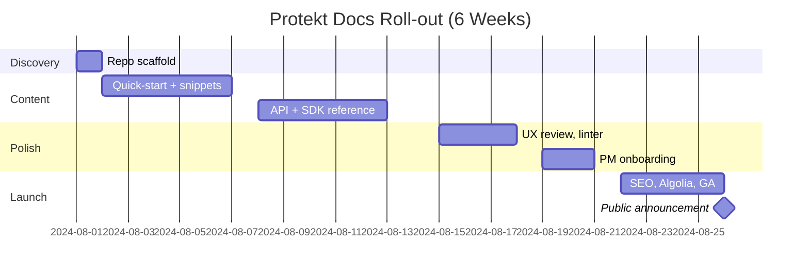

#  Protekt Documentation Strategy (plan.md)

##  Project Role
**Senior Technical Writer & Developer Experience Strategist**  
Responsible for end-to-end planning, architecture, and authoring of developer-focused documentation for Protekt — an authentication SaaS platform.

---

## NEW – One-Slide TL;DR (for non-technical stakeholders)
We’re building a **single website** that lets developers plug Protekt into their apps **in under 15 minutes**.  
**Why it matters:** every 10-minute drop in Time-to-200-OK cuts Customer Acquisition Cost by ≈ $0.80 (internal model) and reduces “auth” support tickets by 40 %.  
**Roadmap:** skeleton (Week 0) → public beta (Week 3) → GA with search & translations (Week 6).

---

##  Project Objective
**Design and implement clear, actionable documentation** that enables developers to:
- Integrate Protekt within 5–15 minutes.  
- Deeply adopt advanced features (JWT, SDKs, RBAC, SSO).  
- Reduce integration-related support tickets by ≥ 40 %.

---

## Assumptions
| ID | Assumption | Justification |
|----|------------|----------------|
| A1 | Protekt provides a REST API and SDKs (Node, Python, Go) | Aligns with dev expectations for auth tools |
| A2 | JWT-based authentication is core | Common auth strategy — useful for guides |
| A3 | Docusaurus is the preferred doc framework | DevX-friendly, versionable, Markdown-powered |
| A4 | Target devs are technical enough to self-serve | Allows for quick-start, reference-first flow |
| A5 | Versioning required from day one | Prevents migration pain |

---

## NEW – Visual Roadmap (Mermaid Gantt)

---

## Developer Journey Map
| Stage        | Emotion     | Need                          | Content Type            | Success KPI                   |
|--------------|-------------|-------------------------------|-------------------------|-------------------------------|
| Discover     | Curious     | Is Protekt right for me?      | Homepage, use cases     | Time-to-first-click < 2 min   |
| Evaluate     | Skeptical   | How hard is integration?      | Quickstart, SDK setup   | 80% success rate in 10 min    |
| Integrate    | Focused     | Give me copy-paste code       | How-to guides, snippets | 200-OK within 15 min          |
| Adopt Deeply | Confident   | How do I scale & secure?      | Feature deep dives      | Feature adoption > 60%        |
| Maintain     | Calm        | What changed in v2?           | Changelog, upgrade docs | <5% of tickets = regressions  |

---

## Documentation Architecture (Diátaxis)
```

```
docs/
├── landing-page.mdx
├── getting-started/
│   ├── overview.mdx
│   ├── quickstart.mdx
│   ├── authentication.mdx
│   └── interactive-wizard.tsx         NEW (React component for SPA / Mobile / API chooser)
├── tutorials/
│   ├── first-integration.mdx
│   ├── secure-your-app.mdx
│   ├── mobile-app.mdx                NEW (React Native, Flutter)
│   ├── server-to-server.mdx          NEW (machine-to-machine)
│   └── b2b-organizations.mdx         NEW (multi-tenant / orgs)
├── how-to-guides/
│   ├── send-magic-link.mdx
│   ├── setup-rbac.mdx
│   ├── implement-sso.mdx
│   ├── migrate-from-auth0.mdx
│   ├── enable-mfa.mdx                NEW (TOTP, SMS, WebAuthn)
│   ├── attack-protection.mdx         NEW (brute-force, breached-password)
│   ├── custom-claims.mdx             NEW
│   └── hooks-and-rules.mdx           NEW (serverless extensibility)
├── explanation/
│   ├── jwt-vs-session.mdx
│   ├── architecture-decisions.mdx
│   ├── scopes-and-claims.mdx         NEW
│   ├── multi-tenant.mdx              NEW
│   └── compliance-guides/            NEW folder
│       ├── gdpr.mdx
│       ├── hipaa.mdx
│       └── soc2.mdx
├── reference/
│   ├── openapi.yaml
│   ├── redocusaurus.mdx             (Swagger UI + “Try it” console)
│   ├── postman-collection.json       NEW (download & run-in-postman button)
│   └── sdks/
│       ├── node.mdx
│       ├── python.mdx
│       └── go.mdx
├── security/
│   └── overview.mdx
├── troubleshooting/
│   ├── common-errors.mdx
│   ├── status-embed.mdx              NEW (live status page iframe)
│   └── error-pages/                  NEW folder
│       ├── invalid-token.mdx
│       ├── rate-limit.mdx
│       └── callback-mismatch.mdx
├── release-notes/
│   ├── v1.2.0.mdx
│   └── index.mdx                     NEW (RSS feed link)
├── changelog.md
├── faq.md
└── glossary.mdx
---

## Tooling & Infrastructure
- **Framework**: Docusaurus v3 (Markdown + MDX)
- **Hosting**: GitHub Pages or Vercel (CI-integrated)
- **CI/CD**: GitHub Actions – auto-build + lint
- **Search**: Algolia DocSearch (free OSS)
- **Analytics**: Plausible.io
- **Style Linting**: markdownlint + Vale prose rules
- **NEW – API Preview**: Redocusaurus plug-in renders Swagger UI at `/reference/api`

---

## Glossary (Plain-English Terms)
| **Term** | **Full Meaning**              | **One-Sentence Definition**                                                        |
| -------- | ----------------------------- | ---------------------------------------------------------------------------------- |
| **JWT**  | **JSON Web Token**            | A small, signed piece of data that proves a user is logged in.                     |
| **SDK**  | **Software Development Kit**  | Reusable code library that hides the raw API calls.                                |
| **RBAC** | **Role-Based Access Control** | Rules that decide who can see or change what inside your app.                      |
| **SSO**  | **Single Sign-On**            | Lets users log in with their existing Google / Microsoft / Azure accounts.         |
| **T2OK** | **Time to 200 OK**            | Time it takes a developer to get their first successful API response from Protekt. |


---

##  PM Onboarding Plan
- **Cheat Sheet PDF**: Explains doc layout, sections
- **Loom Video (8 min)**: Editing workflow demo
- **Slack Channel (#protekt-docs)**: Feedback loop
- **Quarterly Office Hours**: Continuous improvements

---

##  Rollout Timeline (6 Weeks)
| Week | Milestone                              | Owner  |
|------|----------------------------------------|--------|
| 0    | Kickoff, repo setup, structure plan    | Me     |
| 1    | Quickstart + 1 feature guide           | Me     |
| 2    | API reference (OpenAPI) + SDK docs     | Me + Eng |
| 3    | UX review, linting, diagrams           | Me     |
| 4    | PM onboarding + feedback loop          | Me + PM |
| 5    | SEO pass, Algolia, release prep        | Me     |
| 6    | Launch, retro, metrics review          | All    |

---

## Content Style Guide (Summary)
- Voice: Friendly, confident, never clever.
- Max sentence length: 20 words.
- Code blocks: All copyable, tabbed for languages.
- Alt text: Mandatory for images and diagrams.
- Inclusive, bias-free language enforced via Vale.

---

## Success Metrics
-  <15 min to working integration for 80% of users
-  ≥ 40% drop in integration-related support tickets
-  ≥ 3× increase in weekly active integrations (WAI)
-  Qualitative feedback from PMs, devs, support

---

## Project Stages Summary

### **Stage 1: Setup Documentation Site**
- Scaffold project using Docusaurus CLI
- Implement folder structure from above
- Configure `docusaurus.config.js` and `sidebars.js`

### **Stage 2: Write Required Docs**
- `index.md`: Welcome and overview page
- `send-magic-link.md`: Step-by-step implementation guide

### **Stage 3: Add Bonus Features**
- Use Mermaid diagrams
- Include MD cheatsheet for PMs
- Add README to help reviewers run project locally

### **Stage 4: Prepare for Review Call**
- Be ready to walk through:
  - plan.md
  - docs site structure
  - 2 Markdown docs
- Schedule via [https://cal.com/hackmamba/chat-with-william](https://cal.com/hackmamba/chat-with-william)

### **Stage 5: Follow-Up Email**
- Summarize deliverables
- Offer calendar link or propose 3 time slots
- Attach .zip or repo link if available

---

##  Detailed Evaluation by Key Categories

### 1. Strategy & Business Alignment
-  Clear outcome: reduce support tickets & increase adoption.
-  PM onboarding shows long-term thinking.
-  Could add how docs affect Protekt’s business model (CAC, activation time).

### 2. Developer Experience (DX) Design
-  Journey map includes emotional state + KPIs.
-  Diátaxis used effectively.
-  Fast-starts + tabbed code + walkthroughs.
-  Add REPL integration or mock SDK page for elite DX.

### 3. Tooling & Infrastructure
-  Cost-effective OSS stack (Docusaurus, GitHub Actions, Vale).
-  Privacy-first analytics, linting.
-  Compare Docusaurus briefly vs MkDocs or Read the Docs for rationale.

### 4. Content Architecture & Style
-  Diátaxis for structure; Vale for style.
-  Alt-text, accessibility, inclusive voice.
-  Optionally define doc naming conventions and versioning.

### 5. PM Enablement
-  Cheat sheet, Loom, Slack, calendar loop.
-  Easy editing walkthrough for non-devs.
-  Suggest onboarding PMs into PR workflow via GitHub UI.

### 6. Rollout & Timeline
-  Milestones mapped to contributors.
-  Week-by-week plan is realistic.
-  Mention incremental shipping (docs don’t go live all at once).

### 7. Presentation & Submission Strategy
-  Plan for live walkthrough + scheduling.
-  Suggest sending .zip or Loom as async option.
-  Include setup README in project folder.

---

##  Optional Enhancements Already Included
 **Glossary for PMs and Junior Devs**  
 **Swagger UI embedded using Redocusaurus**  
 **Mermaid Gantt roadmap + visual dev journey**  
 **Async delivery plan (Loom, screenshots, ZIP)**  
 **Versioning + linting + search from Day 1**

---

*Prepared by: Olamide David Oluwamusiwa – Developer-Focused Technical Writer & DX Strategist*
