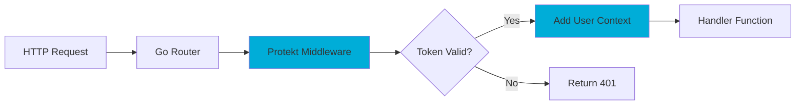

# Go SDK

Add blazing-fast authentication to Go applications. Type-safe middleware for Gin, Echo, and standard net/http.


## Quick Start

Secure your Go API in minutes with idiomatic middleware.

```bash
go get github.com/protekt/go-sdk
```

```go
package main

import (
    "github.com/protekt/go-sdk"
    "github.com/gin-gonic/gin"
)

func main() {
    p := protekt.New("sk_live_your_secret")
    
    r := gin.Default()
    r.Use(p.RequireAuth())
    
    r.GET("/profile", func(c *gin.Context) {
        user := protekt.GetUser(c)
        c.JSON(200, gin.H{"user": user.Name})
    })
    
    r.Run(":8080")
}
```

<Tip>Middleware automatically validates tokens and adds user context with zero allocation overhead.</Tip>

## Framework Integration

<CodeGroup>
```go Gin
import (
    "github.com/gin-gonic/gin"
    "github.com/protekt/go-sdk"
)

func main() {
    p := protekt.New("sk_live_your_secret")
    r := gin.Default()
    
    // Global auth for all routes
    r.Use(p.RequireAuth())
    
    // Role-based protection
    admin := r.Group("/admin")
    admin.Use(p.RequireRole("admin"))
    admin.GET("/users", adminHandler)
    
    r.Run(":8080")
}

func adminHandler(c *gin.Context) {
    user := protekt.GetUser(c)
    c.JSON(200, gin.H{
        "admin": user.Name,
        "permissions": user.Roles,
    })
}
```

```go Echo
import (
    "github.com/labstack/echo/v4"
    "github.com/protekt/go-sdk"
)

func main() {
    p := protekt.New("sk_live_your_secret")
    e := echo.New()
    
    // Echo middleware
    e.Use(p.EchoMiddleware())
    
    e.GET("/profile", func(c echo.Context) error {
        user := protekt.GetUserFromEcho(c)
        return c.JSON(200, map[string]interface{}{
            "id": user.ID,
            "name": user.Name,
        })
    })
    
    e.Start(":8080")
}
```

```go net/http
import (
    "net/http"
    "github.com/protekt/go-sdk"
)

func main() {
    p := protekt.New("sk_live_your_secret")
    
    mux := http.NewServeMux()
    
    // Wrap handler with auth
    mux.Handle("/profile", p.HTTPMiddleware(profileHandler))
    
    http.ListenAndServe(":8080", mux)
}

func profileHandler(w http.ResponseWriter, r *http.Request) {
    user := protekt.GetUserFromRequest(r)
    json.NewEncoder(w).Encode(map[string]string{
        "name": user.Name,
        "email": user.Email,
    })
}
```
</CodeGroup>



## User Management

Manage users with Go's concurrent patterns and error handling.

<CodeGroup>
```go Create Users
package main

import (
    "context"
    "github.com/protekt/go-sdk"
)

func createUser(ctx context.Context) error {
    client := protekt.New("sk_live_your_secret")
    
    user, err := client.Users.Create(ctx, &protekt.CreateUserRequest{
        Email:    "user@example.com",
        Name:     "John Doe",
        Password: "secure-password",
        Metadata: map[string]interface{}{
            "department": "Engineering",
            "level":      "senior",
        },
    })
    
    if err != nil {
        return fmt.Errorf("failed to create user: %w", err)
    }
    
    fmt.Printf("Created user: %s\n", user.ID)
    return nil
}
```

```go Query Users
func getUsers(ctx context.Context) ([]*protekt.User, error) {
    client := protekt.New("sk_live_your_secret")
    
    users, err := client.Users.List(ctx, &protekt.ListUsersRequest{
        Filter: &protekt.UserFilter{
            Email:    protekt.StringFilter{Contains: "@company.com"},
            Roles:    []string{"admin", "moderator"},
        },
        Limit: 100,
    })
    
    if err != nil {
        return nil, fmt.Errorf("failed to list users: %w", err)
    }
    
    return users, nil
}

// Concurrent user updates
func bulkUpdateUsers(ctx context.Context, userIDs []string) error {
    client := protekt.New("sk_live_your_secret")
    
    var wg sync.WaitGroup
    errChan := make(chan error, len(userIDs))
    
    for _, id := range userIDs {
        wg.Add(1)
        go func(userID string) {
            defer wg.Done()
            
            _, err := client.Users.Update(ctx, userID, &protekt.UpdateUserRequest{
                Metadata: map[string]interface{}{
                    "updated_at": time.Now().Unix(),
                },
            })
            
            if err != nil {
                errChan <- err
            }
        }(id)
    }
    
    wg.Wait()
    close(errChan)
    
    for err := range errChan {
        if err != nil {
            return err
        }
    }
    
    return nil
}
```
</CodeGroup>


## Error Handling

Handle authentication errors with Go's idiomatic error patterns.

```go
import "github.com/protekt/go-sdk"

func authHandler(w http.ResponseWriter, r *http.Request) {
    client := protekt.New("sk_live_your_secret")
    
    user, err := client.VerifyToken(r.Header.Get("Authorization"))
    if err != nil {
        switch {
        case protekt.IsTokenExpired(err):
            http.Error(w, "Token expired", http.StatusUnauthorized)
        case protekt.IsInsufficientPermissions(err):
            http.Error(w, "Access denied", http.StatusForbidden)
        case protekt.IsRateLimited(err):
            w.Header().Set("Retry-After", "60")
            http.Error(w, "Rate limited", http.StatusTooManyRequests)
        default:
            http.Error(w, "Authentication failed", http.StatusUnauthorized)
        }
        return
    }
    
    // User authenticated successfully
    json.NewEncoder(w).Encode(user)
}
```

<Warning>Always check for specific error types using the provided helper functions for proper error handling.</Warning>

## Configuration & Performance

<details>
<summary>Advanced Configuration</summary>

```go
client := protekt.New("sk_live_your_secret", 
    protekt.WithAPIURL("https://api.protekt.com"),
    protekt.WithTimeout(30*time.Second),
    protekt.WithRetries(3),
    protekt.WithCache(&protekt.CacheConfig{
        TTL:     5*time.Minute,
        MaxSize: 10000,
        Backend: "redis://localhost:6379",
    }),
    protekt.WithRateLimit(1000), // requests per minute
)
```
</details>

Built-in connection pooling and caching for maximum performance.

```go
// Enable request pooling for high-throughput applications
client := protekt.New("sk_live_your_secret",
    protekt.WithConnectionPool(&protekt.PoolConfig{
        MaxIdleConns:        100,
        MaxIdleConnsPerHost: 10,
        IdleConnTimeout:     90 * time.Second,
    }),
)

// Memory-efficient token caching
cache := protekt.NewMemoryCache(10000) // Cache 10k tokens
client.SetCache(cache)
```

<Tip>Enable caching and connection pooling in production for 10x better performance and lower memory usage.</Tip>

## Testing

Mock authentication for unit tests with testify integration.

```go
import (
    "testing"
    "github.com/protekt/go-sdk/mocks"
    "github.com/stretchr/testify/assert"
)

func TestProtectedHandler(t *testing.T) {
    // Create mock client
    mockClient := mocks.NewMockProtekt()
    mockClient.SetUser(&protekt.User{
        ID:    "usr_123",
        Name:  "Test User",
        Email: "test@example.com",
        Roles: []string{"admin"},
    })
    
    // Test your handler
    req := httptest.NewRequest("GET", "/admin", nil)
    req.Header.Set("Authorization", "Bearer mock-token")
    
    w := httptest.NewRecorder()
    handler := mockClient.RequireRole("admin")(adminHandler)
    handler.ServeHTTP(w, req)
    
    assert.Equal(t, 200, w.Code)
    assert.Contains(t, w.Body.String(), "Test User")
}
```

## Next Steps

Your Go application now has high-performance authentication. Scale further with advanced patterns.

<CardGroup cols={2}>
<Card title="Microservices Auth" icon="server" href="/tutorials/server-to-server">
Service-to-service authentication patterns
</Card>
<Card title="Performance Tuning" icon="zap" href="/security/best-practices">
Optimize for high-throughput workloads
</Card>
<Card title="API Reference" icon="code" href="/reference/api-overview">
Complete Go SDK documentation
</Card>
<Card title="Troubleshooting" icon="wrench" href="/troubleshooting/common-errors">
Common Go SDK issues
</Card>
</CardGroup>