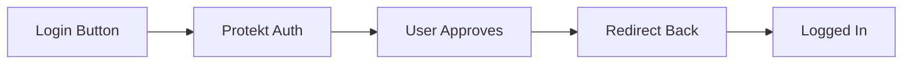

# JavaScript SDK

Add secure authentication to any JavaScript application in minutes. Works with React, Vue, Angular, or vanilla JavaScript.


## Quick Start

Get authentication working in your JavaScript app with three simple steps.

<CodeGroup>
```bash Install
npm install @protekt/javascript
```

```html CDN
<script src="https://cdn.protekt.com/js/protekt.min.js"></script>
```
</CodeGroup>

```javascript Initialize
import Protekt from '@protekt/javascript';

const protekt = new Protekt({
  clientId: 'pk_live_your_client_id',
  redirectUri: window.location.origin + '/callback'
});

await protekt.init();
```

<Tip>Store your client ID in environment variables. Never hardcode credentials in source code.</Tip>

## Authentication Flow

Implement login and logout with simple method calls. The SDK handles OAuth complexity automatically.



<CodeGroup>
```javascript Login
const handleLogin = async () => {
  try {
    await protekt.login({
      returnTo: '/dashboard' // Optional redirect
    });
  } catch (error) {
    console.error('Login failed:', error.message);
  }
};
```

```javascript Handle Callback
// In your /callback page
const handleCallback = async () => {
  try {
    const result = await protekt.handleCallback();
    if (result.success) {
      window.location.href = result.returnTo || '/dashboard';
    }
  } catch (error) {
    console.error('Auth failed:', error.message);
  }
};
```

```javascript Logout
const handleLogout = async () => {
  await protekt.logout();
  console.log('Logged out successfully');
};
```
</CodeGroup>

## Check Authentication Status

Determine if a user is logged in and access their profile data.

<CodeGroup>
```javascript Check Auth Status
const isAuth = await protekt.isAuthenticated();

if (isAuth) {
  const user = await protekt.getUser();
  console.log('Welcome', user.name);
} else {
  console.log('Please log in');
}
```

```javascript Listen for Changes
protekt.onAuthChange((user) => {
  if (user) {
    console.log('User logged in:', user.name);
    showDashboard();
  } else {
    console.log('User logged out');
    showLoginPage();
  }
});
```
</CodeGroup>

## Framework Integration

<CodeGroup>
```jsx React
import { useState, useEffect } from 'react';
import Protekt from '@protekt/javascript';

const protekt = new Protekt({
  clientId: process.env.REACT_APP_PROTEKT_CLIENT_ID,
  redirectUri: window.location.origin + '/callback'
});

function App() {
  const [user, setUser] = useState(null);

  useEffect(() => {
    const init = async () => {
      await protekt.init();
      if (await protekt.isAuthenticated()) {
        setUser(await protekt.getUser());
      }
    };
    init();
  }, []);

  const login = () => protekt.login();
  const logout = () => {
    protekt.logout();
    setUser(null);
  };

  return user ? (
    <div>
      <h1>Welcome, {user.name}!</h1>
      <button onClick={logout}>Logout</button>
    </div>
  ) : (
    <button onClick={login}>Login</button>
  );
}
```

```vue Vue
<template>
  <div>
    <div v-if="user">
      <h1>Welcome, {{ user.name }}!</h1>
      <button @click="logout">Logout</button>
    </div>
    <button v-else @click="login">Login</button>
  </div>
</template>

<script>
import Protekt from '@protekt/javascript';

export default {
  data: () => ({ user: null, protekt: null }),

  async mounted() {
    this.protekt = new Protekt({
      clientId: process.env.VUE_APP_PROTEKT_CLIENT_ID,
      redirectUri: window.location.origin + '/callback'
    });

    await this.protekt.init();
    if (await this.protekt.isAuthenticated()) {
      this.user = await this.protekt.getUser();
    }
  },

  methods: {
    login() { this.protekt.login(); },
    async logout() {
      await this.protekt.logout();
      this.user = null;
    }
  }
}
</script>
```
</CodeGroup>


## Protect Routes & API Calls

Show or hide content based on authentication status and add auth headers to requests.

<CodeGroup>
```javascript Route Protection
const canAccessRoute = async (requiredRole = null) => {
  const isAuth = await protekt.isAuthenticated();
  
  if (!isAuth) {
    protekt.login({ returnTo: window.location.pathname });
    return false;
  }
  
  if (requiredRole) {
    const user = await protekt.getUser();
    return user.roles?.includes(requiredRole);
  }
  
  return true;
};
```

```javascript Authenticated Requests
const makeAuthRequest = async (url, options = {}) => {
  const token = await protekt.getAccessToken();
  
  return fetch(url, {
    ...options,
    headers: {
      ...options.headers,
      'Authorization': `Bearer ${token}`,
      'Content-Type': 'application/json'
    }
  });
};
```
</CodeGroup>

## Error Handling

Handle authentication errors gracefully with built-in error recovery.

```javascript
try {
  await protekt.login();
} catch (error) {
  switch (error.code) {
    case 'NETWORK_ERROR':
      alert('Connection failed. Please try again.');
      break;
    case 'INVALID_CREDENTIALS':
      alert('Invalid email or password.');
      break;
    case 'MFA_REQUIRED':
      window.location.href = error.mfa_challenge_url;
      break;
    default:
      console.error('Auth error:', error);
  }
}
```

<Warning>The SDK automatically handles token storage and refresh. Don't manually manage JWT tokens.</Warning>

## Configuration Options

<details>
<summary>Advanced Configuration</summary>

```javascript
const protekt = new Protekt({
  clientId: 'pk_live_your_client_id',
  redirectUri: 'https://yourapp.com/callback',
  
  // UI customization
  theme: 'dark', // 'light', 'auto'
  logo: 'https://yourapp.com/logo.png',
  
  // Security options
  enablePKCE: true,
  requireHttps: true,
  
  // Token management
  autoRefresh: true,
  refreshThreshold: 300, // seconds
  
  // Multi-tenant
  organization: 'acme-corp'
});
```
</details>

## TypeScript Support

Full TypeScript definitions included for better developer experience.

```typescript
import Protekt, { User, ProtektConfig } from '@protekt/javascript';

const config: ProtektConfig = {
  clientId: process.env.PROTEKT_CLIENT_ID!,
  redirectUri: window.location.origin + '/callback'
};

const user: User = await protekt.getUser();
console.log(user.email); // Type-safe access
```


## Next Steps

You now have authentication working in your JavaScript app. Take it further with advanced features.

<CardGroup cols={2}>
<Card title="User Management" icon="users" href="/how-to-guides/setup-rbac">
Add roles and permissions
</Card>
<Card title="Security Guide" icon="shield-check" href="/security/best-practices">
Secure your authentication
</Card>
<Card title="API Integration" icon="code" href="/reference/api-overview">
Make authenticated requests
</Card>
<Card title="Troubleshooting" icon="wrench" href="/troubleshooting/common-errors">
Common SDK issues
</Card>
</CardGroup>