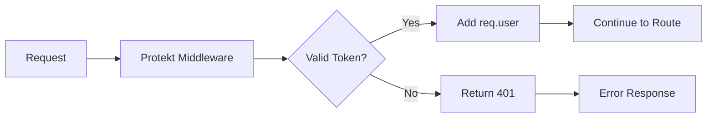

# Node.js SDK

Add enterprise-grade authentication to your Node.js backend. Validate tokens, protect routes, and manage users with simple middleware.


## Quick Start

Secure your Node.js API in under 5 minutes with drop-in middleware.

<CodeGroup>
```bash Install
npm install @protekt/node
```

```bash Environment Setup
# .env file
PROTEKT_CLIENT_SECRET=sk_live_your_secret_key
PROTEKT_CLIENT_ID=pk_live_your_client_id
```
</CodeGroup>

```javascript Basic Setup
const express = require('express');
const { Protekt } = require('@protekt/node');

const app = express();
const protekt = new Protekt({
  clientSecret: process.env.PROTEKT_CLIENT_SECRET
});

// Protect all routes under /api
app.use('/api', protekt.requireAuth());

app.get('/api/profile', (req, res) => {
  // req.user contains authenticated user data
  res.json({ user: req.user });
});

app.listen(3000);
```

<Tip>The middleware automatically validates JWT tokens and populates `req.user` with authenticated user data.</Tip>

## Authentication Middleware

Protect your API endpoints with flexible middleware that validates tokens and handles errors automatically.



<CodeGroup>
```javascript Express Middleware
const express = require('express');
const { requireAuth, optionalAuth } = require('@protekt/node');

const app = express();

// Required authentication
app.get('/api/admin', requireAuth(), (req, res) => {
  res.json({ 
    message: 'Admin area',
    user: req.user 
  });
});

// Optional authentication
app.get('/api/public', optionalAuth(), (req, res) => {
  const greeting = req.user 
    ? `Hello, ${req.user.name}!` 
    : 'Hello, guest!';
    
  res.json({ message: greeting });
});
```

```javascript Role-Based Protection
const { requireAuth } = require('@protekt/node');

// Require specific role
app.get('/api/admin', 
  requireAuth({ role: 'admin' }), 
  (req, res) => {
    res.json({ message: 'Admin only area' });
  }
);

// Require multiple roles (any match)
app.get('/api/moderator', 
  requireAuth({ roles: ['admin', 'moderator'] }), 
  (req, res) => {
    res.json({ message: 'Admin or moderator area' });
  }
);

// Custom permission check
app.get('/api/sensitive', 
  requireAuth({ 
    permission: (user) => user.metadata?.clearanceLevel >= 3 
  }), 
  (req, res) => {
    res.json({ message: 'High clearance required' });
  }
);
```
</CodeGroup>


## Framework Integration

The Node.js SDK works with all popular Node.js frameworks. Here's how to integrate with common setups.

<CodeGroup>
```javascript Express
const express = require('express');
const { Protekt, requireAuth } = require('@protekt/node');

const app = express();
const protekt = new Protekt({
  clientSecret: process.env.PROTEKT_CLIENT_SECRET
});

// Global middleware for all /api routes
app.use('/api', protekt.middleware());

// Individual route protection
app.get('/api/users', requireAuth(), async (req, res) => {
  const users = await getUsersFromDB();
  res.json(users);
});

// Custom error handling
app.use((err, req, res, next) => {
  if (err.name === 'ProtektAuthError') {
    return res.status(401).json({ 
      error: 'Authentication required',
      code: err.code 
    });
  }
  next(err);
});
```

```javascript Fastify
const fastify = require('fastify')();
const { Protekt } = require('@protekt/node');

const protekt = new Protekt({
  clientSecret: process.env.PROTEKT_CLIENT_SECRET
});

// Register as Fastify plugin
fastify.register(async (fastify) => {
  fastify.addHook('preHandler', async (request, reply) => {
    if (request.url.startsWith('/api/protected')) {
      try {
        const user = await protekt.verifyToken(
          request.headers.authorization
        );
        request.user = user;
      } catch (error) {
        reply.code(401).send({ error: 'Unauthorized' });
      }
    }
  });
});

fastify.get('/api/protected/profile', async (request, reply) => {
  return { user: request.user };
});
```

```javascript Koa
const Koa = require('koa');
const { Protekt } = require('@protekt/node');

const app = new Koa();
const protekt = new Protekt({
  clientSecret: process.env.PROTEKT_CLIENT_SECRET
});

// Koa middleware
app.use(async (ctx, next) => {
  if (ctx.path.startsWith('/api/protected')) {
    try {
      const token = ctx.headers.authorization;
      ctx.user = await protekt.verifyToken(token);
    } catch (error) {
      ctx.status = 401;
      ctx.body = { error: 'Unauthorized' };
      return;
    }
  }
  await next();
});

app.use(async (ctx) => {
  if (ctx.path === '/api/protected/profile') {
    ctx.body = { user: ctx.user };
  }
});
```
</CodeGroup>

## User Management

Create, update, and manage users directly from your backend with the management API.

<CodeGroup>
```javascript Create Users
const { Protekt } = require('@protekt/node');

const protekt = new Protekt({
  clientSecret: process.env.PROTEKT_CLIENT_SECRET
});

// Create new user
const newUser = await protekt.users.create({
  email: 'user@example.com',
  name: 'John Doe',
  password: 'secure-password',
  metadata: {
    department: 'Engineering',
    startDate: '2024-01-15'
  }
});

console.log('User created:', newUser.id);
```

```javascript Update Users
// Update user profile
await protekt.users.update('usr_123', {
  name: 'Jane Smith',
  metadata: {
    department: 'Marketing',
    role: 'manager'
  }
});

// Assign roles
await protekt.users.assignRole('usr_123', 'admin');

// Add to organization
await protekt.organizations.addMember('org_456', {
  userId: 'usr_123',
  role: 'member'
});
```

```javascript Query Users
// Get user by ID
const user = await protekt.users.get('usr_123');

// Search users
const users = await protekt.users.list({
  filter: {
    email: { contains: '@company.com' },
    roles: ['admin', 'moderator']
  },
  limit: 50
});

// Get user's organizations
const orgs = await protekt.users.getOrganizations('usr_123');
```
</CodeGroup>

## Token Validation

Validate JWT tokens and access tokens with flexible verification options.

<CodeGroup>
```javascript Manual Token Verification
const { verifyToken } = require('@protekt/node');

// Verify JWT token
const validateRequest = async (req, res, next) => {
  try {
    const token = req.headers.authorization?.replace('Bearer ', '');
    
    if (!token) {
      return res.status(401).json({ error: 'No token provided' });
    }
    
    const user = await verifyToken(token, {
      audience: 'https://api.yourapp.com',
      issuer: 'https://auth.protekt.com'
    });
    
    req.user = user;
    next();
  } catch (error) {
    res.status(401).json({ 
      error: 'Invalid token',
      details: error.message 
    });
  }
};
```

```javascript Token Claims & Scopes
// Verify token with specific claims
const user = await verifyToken(token, {
  requiredClaims: {
    scope: 'read:users write:users',
    org: 'org_123'
  }
});

// Check token expiration
if (user.exp < Date.now() / 1000) {
  throw new Error('Token expired');
}

// Access custom claims
console.log('User department:', user.metadata?.department);
console.log('User roles:', user.roles);
```
</CodeGroup>

<Warning>Always verify tokens on the server side. Never trust client-side token validation alone.</Warning>

## Error Handling

Handle authentication errors gracefully with comprehensive error types and retry logic.

<CodeGroup>
```javascript Error Types
const { requireAuth, ProtektError } = require('@protekt/node');

app.use('/api', (err, req, res, next) => {
  if (err instanceof ProtektError) {
    switch (err.code) {
      case 'TOKEN_EXPIRED':
        return res.status(401).json({
          error: 'Token expired',
          hint: 'Please refresh your token'
        });
        
      case 'INSUFFICIENT_PERMISSIONS':
        return res.status(403).json({
          error: 'Access denied',
          required: err.details.required,
          actual: err.details.actual
        });
        
      case 'RATE_LIMITED':
        return res.status(429).json({
          error: 'Rate limit exceeded',
          retryAfter: err.details.retryAfter
        });
        
      default:
        return res.status(401).json({
          error: 'Authentication failed'
        });
    }
  }
  
  next(err);
});
```

```javascript Retry Logic
const retryWithBackoff = async (fn, maxRetries = 3) => {
  for (let attempt = 1; attempt <= maxRetries; attempt++) {
    try {
      return await fn();
    } catch (error) {
      if (error.code === 'NETWORK_ERROR' && attempt < maxRetries) {
        const delay = Math.pow(2, attempt) * 1000;
        await new Promise(resolve => setTimeout(resolve, delay));
        continue;
      }
      throw error;
    }
  }
};

// Usage
const user = await retryWithBackoff(() => 
  protekt.users.get('usr_123')
);
```
</CodeGroup>

## Configuration Options

<details>
<summary>Advanced Configuration</summary>

```javascript
const protekt = new Protekt({
  clientSecret: process.env.PROTEKT_CLIENT_SECRET,
  
  // API endpoint (for self-hosted)
  apiUrl: 'https://your-protekt-instance.com',
  
  // Token validation options
  tokenValidation: {
    audience: 'https://api.yourapp.com',
    issuer: 'https://auth.protekt.com',
    clockTolerance: 60 // seconds
  },
  
  // Caching (improves performance)
  cache: {
    enabled: true,
    ttl: 300, // 5 minutes
    maxSize: 1000
  },
  
  // Rate limiting
  rateLimit: {
    enabled: true,
    max: 100, // requests per window
    windowMs: 60000 // 1 minute
  },
  
  // Debug mode
  debug: process.env.NODE_ENV === 'development'
});
```
</details>

## Performance & Caching


The SDK includes built-in caching to reduce API calls and improve response times.

```javascript
// Enable caching for better performance
const protekt = new Protekt({
  clientSecret: process.env.PROTEKT_CLIENT_SECRET,
  cache: {
    enabled: true,
    ttl: 300, // Cache tokens for 5 minutes
    maxSize: 1000 // Cache up to 1000 tokens
  }
});

// Manual cache control
await protekt.cache.clear(); // Clear all cached tokens
await protekt.cache.delete(tokenHash); // Clear specific token
```

<Tip>Enable caching in production to reduce latency by up to 80% for token validation.</Tip>

## Next Steps

Your Node.js backend is now secured with Protekt authentication. Explore advanced features and optimizations.

<CardGroup cols={2}>
<Card title="API Reference" icon="code" href="/reference/api-overview">
Explore all available endpoints
</Card>
<Card title="Security Best Practices" icon="shield-check" href="/security/best-practices">
Secure your backend implementation
</Card>
<Card title="Organization Management" icon="building" href="/tutorials/b2b-organizations">
Add multi-tenant support
</Card>
<Card title="Troubleshooting" icon="wrench" href="/troubleshooting/common-errors">
Common Node.js SDK issues
</Card>
</CardGroup>