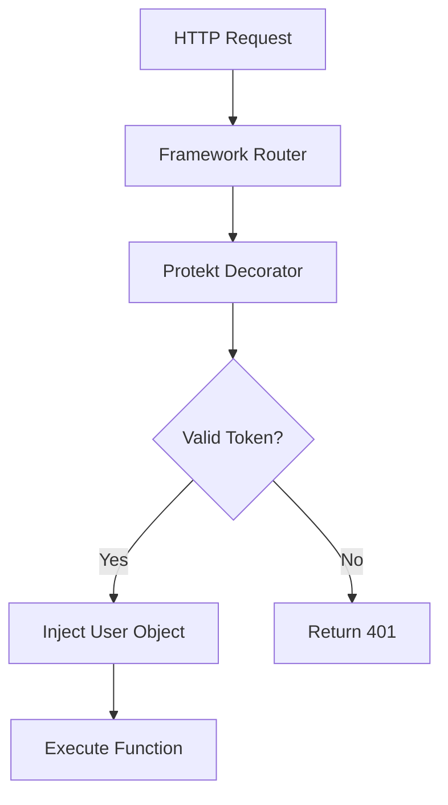

# Python SDK

Add enterprise authentication to Django, Flask, or FastAPI. Pythonic decorators and middleware make integration seamless.


## Quick Start

Secure your Python web app in 3 steps.

```bash
pip install protekt-python
```

```python
from protekt import Protekt

# Initialize client
protekt = Protekt(client_secret="sk_live_your_secret")

# Protect any function
@protekt.require_auth
def protected_view(request, user):
    return {"message": f"Hello, {user.name}!"}
```

<Tip>The decorator automatically validates tokens and injects user data into your function.</Tip>

## Framework Integration

<CodeGroup>
```python Django
# settings.py
PROTEKT_CLIENT_SECRET = "sk_live_your_secret"

# views.py
from protekt.django import require_auth

@require_auth
def profile_view(request, user):
    return JsonResponse({
        'user': user.name,
        'email': user.email
    })

# Optional: role-based protection
@require_auth(role='admin')
def admin_view(request, user):
    return JsonResponse({'admin_data': 'secret'})
```

```python Flask
from flask import Flask
from protekt.flask import require_auth, Protekt

app = Flask(__name__)
protekt = Protekt(client_secret="sk_live_your_secret")

@app.route('/profile')
@require_auth
def profile(user):
    return {
        'user': user.name,
        'roles': user.roles
    }

@app.route('/admin')
@require_auth(roles=['admin', 'moderator'])
def admin(user):
    return {'message': 'Admin area'}
```

```python FastAPI
from fastapi import FastAPI, Depends
from protekt.fastapi import get_current_user, require_role

app = FastAPI()

@app.get('/profile')
async def profile(user = Depends(get_current_user)):
    return {
        'id': user.id,
        'name': user.name,
        'email': user.email
    }

@app.get('/admin')
async def admin(user = Depends(require_role('admin'))):
    return {'message': 'Admin only'}
```
</CodeGroup>



## User Management

Create and manage users programmatically from your Python backend.

<CodeGroup>
```python Create & Update Users
from protekt import Protekt

protekt = Protekt(client_secret="sk_live_your_secret")

# Create new user
user = await protekt.users.create(
    email="user@example.com",
    name="John Doe",
    password="secure-password",
    metadata={"department": "Engineering"}
)

# Update user
await protekt.users.update(user.id, {
    "name": "Jane Smith",
    "metadata": {"role": "manager"}
})

# Assign roles
await protekt.users.assign_role(user.id, "admin")
```

```python Query Users
# Get user by ID
user = await protekt.users.get("usr_123")

# Search users
users = await protekt.users.list(
    filter={
        "email__contains": "@company.com",
        "roles__in": ["admin", "moderator"]
    },
    limit=50
)

# Bulk operations
user_ids = ["usr_1", "usr_2", "usr_3"]
await protekt.users.bulk_update(user_ids, {
    "metadata": {"department": "Sales"}
})
```
</CodeGroup>


## Token Validation

Manual token verification for custom authentication flows.

<CodeGroup>
```python Validate Tokens
from protekt import verify_token, ProtektError

def custom_auth_middleware(request):
    try:
        token = request.headers.get('Authorization', '').replace('Bearer ', '')
        user = verify_token(token)
        request.user = user
    except ProtektError as e:
        return JsonResponse({'error': str(e)}, status=401)
```

```python Django Middleware
class ProtektAuthMiddleware:
    def __init__(self, get_response):
        self.get_response = get_response

    def __call__(self, request):
        if request.path.startswith('/api/protected/'):
            try:
                token = request.META.get('HTTP_AUTHORIZATION', '').replace('Bearer ', '')
                request.user = verify_token(token)
            except ProtektError:
                return JsonResponse({'error': 'Unauthorized'}, status=401)
        
        return self.get_response(request)
```
</CodeGroup>

## Error Handling

Handle authentication errors with Python exception patterns.

```python error-handling.py
from protekt import ProtektError, TokenExpiredError, InsufficientPermissionsError

@require_auth
def protected_view(request, user):
    try:
        # Your protected logic here
        return {'data': 'sensitive_info'}
    except TokenExpiredError:
        return JsonResponse({'error': 'Token expired'}, status=401)
    except InsufficientPermissionsError as e:
        return JsonResponse({
            'error': 'Access denied',
            'required': e.required_permissions
        }, status=403)
    except ProtektError as e:
        return JsonResponse({'error': str(e)}, status=400)
```

<Warning>Always handle `ProtektError` exceptions to provide meaningful error responses to clients.</Warning>

## Configuration

<details>
<summary>Advanced Configuration</summary>

```python
from protekt import Protekt

protekt = Protekt(
    client_secret="sk_live_your_secret",
    
    # API endpoint (for self-hosted)
    api_url="https://your-protekt-instance.com",
    
    # Token validation
    audience="https://api.yourapp.com",
    issuer="https://auth.protekt.com",
    
    # Caching (Redis recommended for production)
    cache_backend="redis://localhost:6379/0",
    cache_ttl=300,  # 5 minutes
    
    # Debug mode
    debug=True
)
```
</details>

## Async Support

Full async/await support for modern Python web frameworks.

```python
import asyncio
from protekt import AsyncProtekt

# Async client
protekt = AsyncProtekt(client_secret="sk_live_your_secret")

# Async user operations
async def create_user_async():
    user = await protekt.users.create(
        email="async@example.com",
        name="Async User"
    )
    return user

# FastAPI with async
@app.get('/async-profile')
async def async_profile(user = Depends(get_current_user)):
    # Async database operations
    user_data = await fetch_user_data_async(user.id)
    return {'data': user_data}
```


## CLI Tools

Manage users and organizations from command line.

```bash
# Install CLI
pip install protekt-python[cli]

# Set credentials
export PROTEKT_CLIENT_SECRET=sk_live_your_secret

# Create user
protekt users create --email user@example.com --name "John Doe"

# List users
protekt users list --filter role=admin

# Bulk import from CSV
protekt users import --file users.csv
```

<Tip>Use CLI tools for bulk operations and administrative tasks. Perfect for DevOps workflows.</Tip>

## Testing

Mock Protekt for unit tests without API calls.

```python
from protekt.testing import mock_protekt, create_test_user

@mock_protekt
def test_protected_view():
    # Mock user automatically injected
    user = create_test_user(name="Test User", roles=["admin"])
    
    response = client.get('/admin', headers={
        'Authorization': f'Bearer {user.mock_token}'
    })
    
    assert response.status_code == 200
    assert response.json()['message'] == 'Admin area'
```

## Next Steps

Your Python application is now secured with Protekt. Explore advanced features and integrations.

<CardGroup cols={2}>
<Card title="Django Integration" icon="python" href="/tutorials/b2b-organizations">
Advanced Django patterns and middleware
</Card>
<Card title="API Reference" icon="code" href="/reference/api-overview">
Complete Python SDK documentation
</Card>
<Card title="Security Guide" icon="shield-check" href="/security/best-practices">
Python-specific security practices
</Card>
<Card title="Troubleshooting" icon="wrench" href="/troubleshooting/common-errors">
Common Python SDK issues
</Card>
</CardGroup>