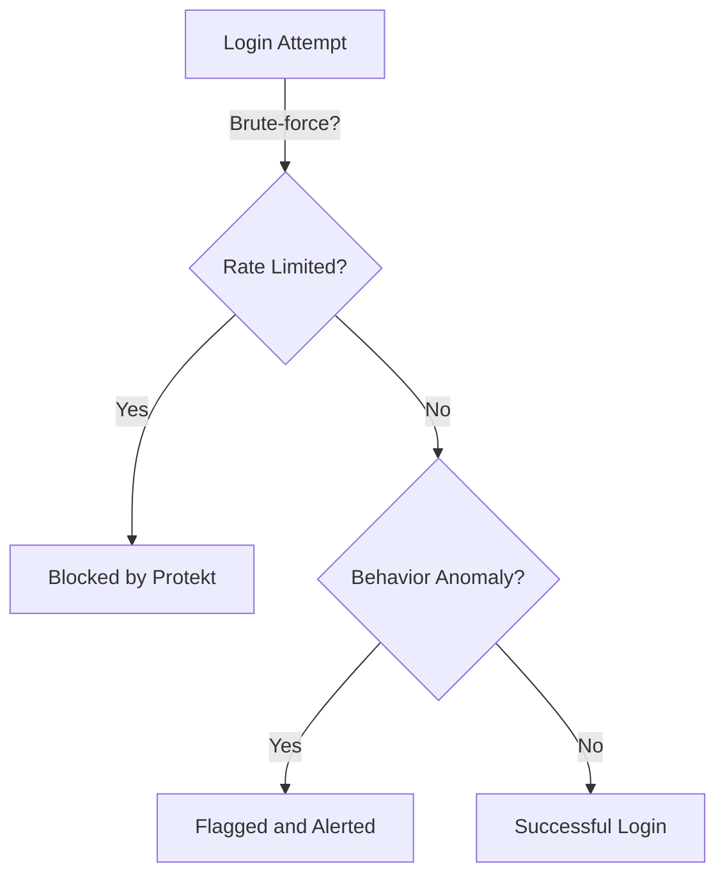

---

title: "Security Overview"
description: "How Protekt keeps your app and user data secure with encryption, RBAC, audit trails, and best practices."
--------------------------------------------------------------------------------------------------------------------

#  Security Overview

Protekt provides enterprise-grade security out of the box. In this guide, you’ll learn how Protekt protects user data, ensures safe API access, and helps you comply with modern security standards.

<Warning>Never expose secret keys or JWTs in the browser.</Warning>

<Tip>Store access tokens in secure HTTP-only cookies, not `localStorage`.</Tip>

---

##  Why Security Matters

Security breaches cost companies millions. But good security doesn’t have to slow you down. Protekt simplifies secure-by-default development:

* End-to-end encryption for sensitive data
* Role-based access control (RBAC)
* Real-time audit logging
* Secret management and key rotation
* OWASP Top 10 compliance out-of-the-box

<Info>Protekt automatically monitors API abuse and suspicious behavior patterns across your endpoints.</Info>

---

##  Authentication & Token Security

Protekt uses JWTs (JSON Web Tokens) for authentication, signed and optionally encrypted.

**Key practices:**

* Tokens are short-lived and require refresh tokens for long sessions.
* Signing keys rotate every 90 days.
* Device-level fingerprinting reduces token hijacking.

<Warning>Always validate JWTs on the server before trusting any claims.</Warning>

### Sample Token Payload

```json
{
  "sub": "user_123",
  "role": "admin",
  "exp": 1699238432,
  "aud": "protekt.app"
}
```

Use environment variables like `PROTEKT_PUBLIC_KEY` and `PROTEKT_SECRET_KEY` for token verification.

<details>
<summary>Show advanced token verification setup</summary>

```ts
import { verifyToken } from "@protekt/node";

const payload = verifyToken(token, process.env.PROTEKT_PUBLIC_KEY);
```

</details>

---

##  Role-Based Access Control (RBAC)

RBAC lets you define access rules based on roles such as `admin`, `user`, `editor`, etc. This ensures:

* Admin-only access to sensitive dashboards
* User-specific access to personal data
* Fine-grained permissions for teams

Read the full [RBAC setup guide →](/how-to-guides/setup-rbac)

```ts
if (!hasRole(user, "admin")) {
  return res.status(403).send("Forbidden");
}
```

<Info>Protekt supports dynamic permission policies via API and UI.</Info>

---

##  Audit Trails

Every authentication and role change is logged securely.

**Example logs:**

```json
{
  "event": "role.updated",
  "user": "user_123",
  "actor": "admin_456",
  "timestamp": "2025-08-11T12:00:00Z"
}
```

Audit logs are tamper-proof and exportable to SIEM tools like Datadog, Splunk, or AWS CloudTrail.

---

##  Key Rotation & Secret Management

You can rotate keys and secrets from the Protekt dashboard.

* Rotate signing keys
* Regenerate client secrets
* Use API to disable compromised keys

```bash
curl -X POST \
  https://api.protekt.dev/v1/keys/rotate \
  -H "Authorization: Bearer YOUR_ADMIN_TOKEN"
```

<Warning>Never hardcode secrets into your source code. Use environment variables instead.</Warning>

---

##  Threat Detection & Abuse Monitoring

Protekt includes real-time threat detection:

* IP-based rate limiting
* Behavior anomaly detection
* Brute-force login protection
* Email alerts for unusual activity

**Diagram: Attack prevention flow**



---

##  API Security with OpenAPI

Protekt automatically validates API requests against your OpenAPI schema.

```ts
app.post("/create-user", authenticate, validateSchema("createUser"), handler);
```

<SwaggerUI specUrl="/openapi.yaml" />

---
## Next

<CardGroup cols={2}>
<Card
  title="Security Best Practices"
  icon="shield"
  href="/security/best-practices"
>
  10-step checklist to lock down your auth
</Card>
<Card
  title="FAQs"
  icon="book"
  href="/faqs"
>
  Common asked questions
</Card>
</CardGroup>

---

Want to go deeper? [Ask anything about Protekt security →](/search)
