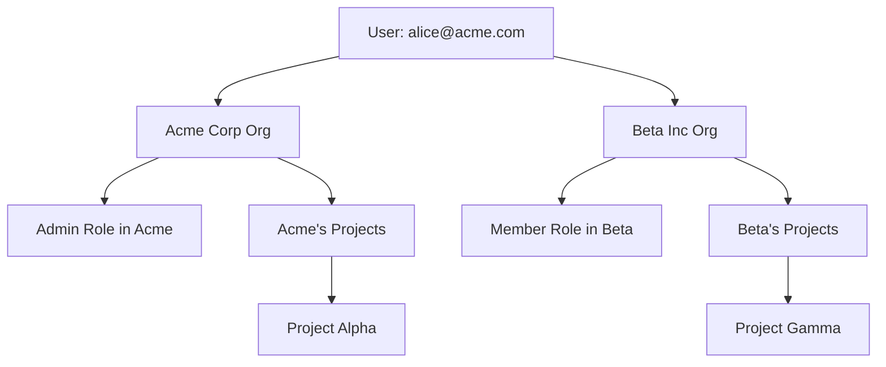

# B2B Organizations & Multi-Tenant Auth

Transform your SaaS into an enterprise-ready platform. Give each customer their own secure workspace with role-based permissions.


## What is Multi-Tenant Authentication?

Multi-tenant auth lets you serve multiple **organizations** (tenants) from a single app. Each organization has:

- **Isolated data** — Company A never sees Company B's users
- **Custom roles** — Different permission levels per organization  
- **Independent billing** — Separate subscriptions and limits

Think Slack workspaces, GitHub organizations, or Notion teams.

<Tip>
**Enterprise buyers expect this.** 73% of B2B SaaS deals require organization-level access control.
</Tip>

## Architecture Overview

Here's how users, organizations, and permissions connect:



**Key insight**: Alice can be an Admin at Acme Corp but just a Member at Beta Inc.

## Step 1: Create Your First Organization

Organizations start with a **workspace name** and **primary domain**.

<CodeGroup>
```javascript Dashboard API
const org = await protekt.organizations.create({
  name: "Acme Corp",
  domain: "acme.com",
  metadata: {
    industry: "SaaS",
    size: "50-100"
  }
});

console.log(`Created org: ${org.id}`);
```

```bash CLI Setup
# In Protekt Dashboard
1. Go to Organizations → Create New
2. Name: "Acme Corp" 
3. Domain: "acme.com"
4. Save
```
</CodeGroup>

<Warning>
**Domain verification required** for SSO. Users with `@acme.com` emails auto-join this organization.
</Warning>

## Step 2: Invite and Manage Members

Add users to organizations with specific roles.

<CodeGroup>
```javascript Member Invitation
// Invite a new member
const invitation = await protekt.organizations.invite({
  orgId: "org_acme_123",
  email: "bob@acme.com",
  role: "admin",
  message: "Welcome to Acme's workspace!"
});

// List all members
const members = await protekt.organizations.getMembers("org_acme_123");
console.log(`${members.length} team members`);
```
</CodeGroup>

**Invitation flow:** Bob gets email → clicks join link → auto-added to Acme Corp with Admin role.


## Step 3: Role-Based Access Control

Define what each role can do **within the organization**.

<CodeGroup>
```javascript Role Management
// Define custom roles for this org
const roles = {
  owner: {
    permissions: ["read", "write", "delete", "invite", "billing"]
  },
  admin: {
    permissions: ["read", "write", "delete", "invite"]  
  },
  member: {
    permissions: ["read", "write"]
  }
};

// Check user's role in current org
const userRole = await protekt.organizations.getUserRole({
  userId: "user_alice_456",
  orgId: "org_acme_123" 
});

if (userRole.permissions.includes("delete")) {
  // Show delete button
}
```
</CodeGroup>

## Step 4: Frontend Organization Switcher

Let users switch between organizations they belong to.

<CodeGroup>
```javascript React Organization Switcher
// Get all orgs for current user
const userOrgs = await protekt.user.getOrganizations();

const OrgSwitcher = () => {
  const [currentOrg, setCurrentOrg] = useState(userOrgs[0]);
  
  return (
    <select 
      value={currentOrg.id}
      onChange={(e) => switchOrganization(e.target.value)}
    >
      {userOrgs.map(org => (
        <option key={org.id} value={org.id}>
          {org.name}
        </option>
      ))}
    </select>
  );
};

const switchOrganization = async (orgId) => {
  await protekt.organizations.switchContext(orgId);
  window.location.reload();
};
```
</CodeGroup>

**UX tip**: Show organization name in your app header so users know their current context.

## Step 5: Data Isolation

Ensure each organization only sees their own data.

<CodeGroup>
```javascript Backend Route Protection
// Backend route protection
app.get('/api/projects', protekt.requireAuth(), async (req, res) => {
  const { orgId } = req.user.currentOrganization;
  
  // Only fetch projects for this organization
  const projects = await Project.find({ 
    organizationId: orgId 
  });
  
  res.json(projects);
});
```

```javascript Database Schema
// Database schema example
const ProjectSchema = {
  id: String,
  name: String,
  organizationId: String, // ← Key isolation field
  createdBy: String,
  createdAt: Date
};
```
</CodeGroup>

<Warning>
**Never skip orgId filters** in your database queries. One missing filter can leak data between organizations.
</Warning>

## Enterprise Features

<CodeGroup>
```javascript SSO Integration
const ssoConfig = await protekt.organizations.setupSSO({
  orgId: "org_acme_123",
  provider: "okta",
  domain: "acme.okta.com",
  autoProvisioning: true
});
```

```javascript Custom Branding
await protekt.organizations.setBranding({
  orgId: "org_acme_123", 
  logo: "https://acme.com/logo.png",
  primaryColor: "#FF6B35",
  customDomain: "login.acme.com"
});
```
</CodeGroup>

## Testing Your Setup

Verify multi-tenancy works correctly:

<CodeGroup>
```bash Quick Test Script
# Test user organizations
curl -H "Authorization: Bearer $TOKEN" \
     https://api.protekt.com/me/organizations

# Should return array of orgs user belongs to
```
</CodeGroup>

**Checklist:**
1. Create 2 test organizations
2. Add the same user to both  
3. Switch between them
4. Confirm data isolation

## Next Steps

You've built enterprise-grade multi-tenant authentication with organization management, role-based permissions, and secure data isolation. Your SaaS is now ready for B2B customers who demand team collaboration and access control.

<CardGroup cols={2}>
<Card title="Implement SSO" icon="key" href="/how-to-guides/implement-sso">
Enterprise single sign-on integration
</Card>
<Card title="Advanced RBAC" icon="users-gear" href="/how-to-guides/setup-rbac">
Custom permissions and role hierarchies
</Card>
<Card title="Security Best Practices" icon="shield-check" href="/security/best-practices">
Audit logs and compliance patterns
</Card>
<Card title="API Reference" icon="code" href="/reference/organizations">
Complete organizations API documentation
</Card>
</CardGroup>