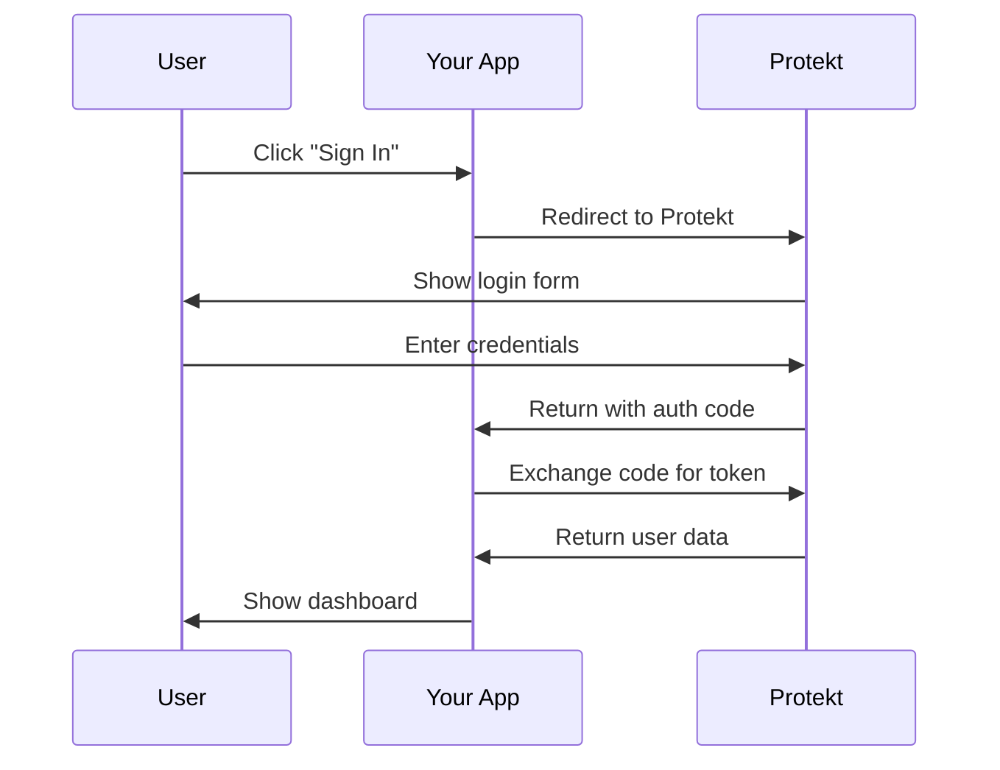

In this tutorial, you'll learn how to build a complete login system. By the end, you'll have signup, signin, user profiles, and protected routes working seamlessly together.

## Goal of this tutorial

Authentication touches every part of your application. This tutorial walks you through building a React app with Express backend that handles:
1. User registration and login: Secure signup/signin flows
2. Protected dashboard pages: Routes that require authentication  
3. User profile management: View and update user data
4. Secure logout flow: Clean session termination

## Architecture overview



<Tip>This flow follows OAuth 2.0 standards, making it secure and compatible with enterprise requirements.</Tip>

## Setup project & install sdk

Modern authentication requires both frontend and backend coordination. We'll create a clean separation that scales well.

**Why this architecture?** Your frontend handles user interactions while your backend manages sensitive operations like token validation.

<CodeGroup>
```bash Project Setup
mkdir my-auth-app && cd my-auth-app
mkdir frontend backend
```

```bash Frontend Setup
cd frontend
npx create-react-app . --template typescript
npm install @protekt/react
```

```bash Backend Setup
cd ../backend
npm init -y
npm install express @protekt/node cors dotenv
```
</CodeGroup>

Configure your environment variables:

```bash .env
PROTEKT_CLIENT_ID=your_client_id_here
PROTEKT_CLIENT_SECRET=your_client_secret_here  
PROTEKT_REDIRECT_URI=http://localhost:3000/callback
```

<Warning>Never commit secrets to version control. Use `.env` files locally and secure vaults in production.</Warning>

## Add sign-up or sign-in buttons

The `ProtektProvider` component wraps your entire app, managing authentication state automatically. Think of it as a smart container that knows whether users are logged in.

<CodeGroup>
```tsx AuthProvider.tsx
import { ProtektProvider } from '@protekt/react';

export default function AuthProvider({ children }) {
  return (
    <ProtektProvider
      clientId={process.env.REACT_APP_PROTEKT_CLIENT_ID}
      redirectUri="http://localhost:3000/callback"
    >
      {children}
    </ProtektProvider>
  );
}
```

```tsx Login.tsx
import { useProtekt } from '@protekt/react';

export default function Login() {
  const { user, login, isLoading, error } = useProtekt();
  
  if (isLoading) return <div>Checking authentication...</div>;
  if (error) return <div>Error: {error.message}</div>;
  if (user) return <div>Welcome back, {user.email}!</div>;
  
  return (
    <div className="login-container">
      <h1>Welcome to My App</h1>
      <button onClick={() => login()}>
        Sign In with Protekt
      </button>
      <button onClick={() => login({ screen: 'signup' })}>
        Create Account  
      </button>
    </div>
  );
}
```
</CodeGroup>

## Handle callback

The callback page is where OAuth magic happens. When users complete authentication on Protekt's servers, they're redirected back to your app with a special code.

**Why callbacks matter:** This step exchanges the temporary code for permanent tokens. It's like trading a restaurant ticket for your actual meal.

<CodeGroup>
```tsx Callback.tsx
import { useProtekt } from '@protekt/react';
import { useEffect } from 'react';

export default function Callback() {
  const { handleCallback, isLoading } = useProtekt();
  const navigate = useNavigate();
  
  useEffect(() => {
    const processCallback = async () => {
      try {
        await handleCallback();
        navigate('/dashboard');
      } catch (error) {
        navigate('/login');
      }
    };
    processCallback();
  }, []);
  
  return <div>{isLoading ? 'Completing sign in...' : 'Redirecting...'}</div>;
}
```

```javascript server.js
import { Protekt } from '@protekt/node';

const protekt = new Protekt({
  clientId: process.env.PROTEKT_CLIENT_ID,
  clientSecret: process.env.PROTEKT_CLIENT_SECRET
});

app.get('/auth/callback', async (req, res) => {
  try {
    const { user, tokens } = await protekt.handleCallback(req.query.code);
    res.json({ success: true, user, tokens });
  } catch (error) {
    res.status(400).json({ error: error.message });
  }
});
```
</CodeGroup>

## Fetch user data

Once authenticated, your app needs user information. The profile component demonstrates how to securely fetch data using access tokens.

**Token-based requests** include the user's access token in the Authorization header. This proves the request comes from an authenticated user.

<CodeGroup>
```tsx UserProfile.tsx
export default function UserProfile() {
  const { user, getAccessToken } = useProtekt();
  const [profile, setProfile] = useState(null);
  
  useEffect(() => {
    const fetchProfile = async () => {
      const token = await getAccessToken();
      const response = await fetch('/api/profile', {
        headers: { 'Authorization': `Bearer ${token}` }
      });
      const data = await response.json();
      setProfile(data.user);
    };
    
    if (user) fetchProfile();
  }, [user]);
  
  return profile ? (
    <div className="profile">
      
      <h2>{profile.name}</h2>
      <p>{profile.email}</p>
    </div>
  ) : <div>Loading profile...</div>;
}
```

```javascript profile.js
router.get('/profile', protekt.requireAuth, (req, res) => {
  // req.user populated by Protekt middleware
  res.json({
    user: {
      id: req.user.id,
      email: req.user.email,
      name: req.user.name,
      avatar: req.user.picture
    }
  });
});
```
</CodeGroup>

## Protect routes

Route protection ensures only authenticated users access sensitive pages. The `ProtectedRoute` wrapper component makes this elegant and reusable.

<CodeGroup>
```tsx ProtectedRoute.tsx  
export default function ProtectedRoute({ children, requiredPermission }) {
  const { user, isLoading, hasPermission } = useProtekt();
  
  if (isLoading) return <div>Checking access...</div>;
  if (!user) return <Navigate to="/login" replace />;
  
  if (requiredPermission && !hasPermission(requiredPermission)) {
    return <div>Access denied</div>;
  }
  
  return <>{children}</>;
}
```

```tsx Dashboard.tsx
export default function Dashboard() {
  const { user, logout } = useProtekt();
  
  return (
    <div className="dashboard">
      <header>
        <h1>Dashboard</h1>
        <button onClick={logout}>Sign Out</button>
      </header>
      <main>
        <h2>Welcome back, {user?.name}!</h2>
        <UserProfile />
      </main>
    </div>
  );
}
```
</CodeGroup>

## Test locally

Testing authentication requires running both servers simultaneously. Each handles different responsibilities in the auth flow.

<CodeGroup>
```bash backend
cd backend && npm run dev
# Runs on http://localhost:3001
```

```bash frontend
cd frontend && npm start
# Runs on http://localhost:3000
```
</CodeGroup>

**Test these critical flows:**
1. Registration Flow: New users can create accounts
2. Login Flow: Existing users can sign in  
3. Route Protection: Unauthenticated users can't access `/dashboard`
4. Profile Access: Logged-in users see their information
5. Logout Flow: Users can securely sign out

<Tip>Open browser dev tools to watch network requests and see tokens being exchanged.</Tip>

## Next steps

**Congratulations!** You built a production-ready authentication system covering the complete user lifecycle. Your app now handles registration, login, profile management, route protection, and secure logout.

**What you accomplished:**
- OAuth 2.0 compliant authentication
- Secure token handling
- Protected routes and APIs
- User profile management

<CardGroup cols={2}>
  <Card title="Enable MFA" icon="lock" href="/guides/enable-mfa">
    Add two-factor authentication to strengthen account security.
  </Card>
  <Card title="Manage Organizations" icon="users" href="/tutorials/b2b-multi-tenant-app">
    Create organizations and assign users with role-based permissions.
  </Card>
  <Card title="Mobile Integration" icon="smartphone" href="/tutorials/mobile-app-integration">
    Set up authentication in React Native or Flutter apps.
  </Card>
  <Card title="Implement SSO" icon="key" href="/guides/implement-sso">
    Connect enterprise identity providers like Google, Microsoft, or Okta.
  </Card>
</CardGroup>
