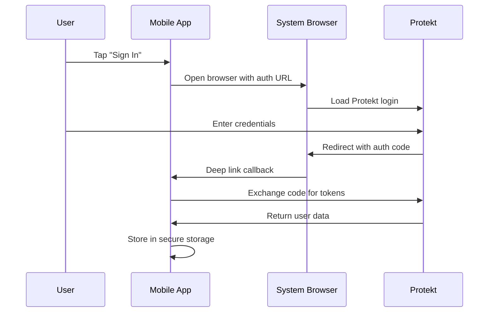

# Mobile App Integration Overview

Mobile authentication requires different approaches than web apps. Users expect biometric login, offline capabilities, and seamless app-to-app transitions. This tutorial covers React Native and Flutter integration with secure token storage and native platform features.

## Mobile Auth Challenges

Mobile apps face unique security and UX challenges that web apps don't encounter:

**Security concerns:**
- Apps can be decompiled and reverse-engineered
- Tokens must survive app restarts and updates
- Biometric authentication integration
- Deep link hijacking prevention

**User experience expectations:**
- Instant app launches with cached authentication
- Biometric unlock (Face ID, Touch ID, fingerprint)
- Seamless handoff from web to mobile
- Offline access to cached user data



<Info>Mobile OAuth uses **Authorization Code + PKCE** flow for enhanced security against app impersonation.</Info>

## Supported Frameworks

Protekt provides native SDKs for the most popular mobile development frameworks, each optimized for platform-specific features.

**React Native**: JavaScript-based development with native performance. Great for teams already using React for web applications.

**Flutter**: Dart-based cross-platform framework with excellent performance and growing ecosystem.

Both frameworks support:
- Secure keychain/keystore integration
- Biometric authentication
- Deep linking
- Background token refresh
- Offline-first architecture

<Warning>Never use AsyncStorage or SharedPreferences for tokens—always use secure storage solutions.</Warning>

## React Native Setup

React Native apps need additional dependencies for secure storage and browser integration. The setup process ensures tokens are encrypted and biometrics work properly.

<CodeGroup>
```bash Installation
npm install @protekt/react-native
npm install react-native-keychain
npm install @react-native-async-storage/async-storage
npm install react-native-app-auth

# iOS additional setup
cd ios && pod install
```

```tsx AuthProvider.tsx
import { ProtektProvider } from '@protekt/react-native';
import * as Keychain from 'react-native-keychain';

const keychainOptions = {
  accessControl: Keychain.ACCESS_CONTROL.BIOMETRY_CURRENT_SET,
  authenticatePrompt: 'Authenticate to access your account',
  service: 'MyApp',
};

export default function AuthProvider({ children }) {
  return (
    <ProtektProvider
      clientId="your_mobile_client_id"
      redirectUri="myapp://auth/callback"
      storage={{
        getItem: async (key) => {
          const credentials = await Keychain.getInternetCredentials(key);
          return credentials ? credentials.password : null;
        },
        setItem: async (key, value) => {
          await Keychain.setInternetCredentials(key, 'user', value, keychainOptions);
        },
        removeItem: async (key) => {
          await Keychain.resetInternetCredentials(key);
        }
      }}
    >
      {children}
    </ProtektProvider>
  );
}
```

```tsx LoginScreen.tsx
import { useProtekt } from '@protekt/react-native';
import { Alert, TouchableOpacity, Text } from 'react-native';

export default function LoginScreen() {
  const { user, login, loginWithBiometrics, isLoading } = useProtekt();

  const handleBiometricLogin = async () => {
    try {
      await loginWithBiometrics();
    } catch (error) {
      Alert.alert('Biometric Login Failed', error.message);
    }
  };

  if (user) {
    return <Text>Welcome back, {user.name}!</Text>;
  }

  return (
    <View style={styles.container}>
      <TouchableOpacity 
        style={styles.loginButton} 
        onPress={() => login()}
        disabled={isLoading}
      >
        <Text>Sign In with Protekt</Text>
      </TouchableOpacity>
      
      <TouchableOpacity 
        style={styles.biometricButton}
        onPress={handleBiometricLogin}
      >
        <Text>Use Face ID / Touch ID</Text>
      </TouchableOpacity>
    </View>
  );
}
```
</CodeGroup>

## Flutter Implementation

Flutter's approach uses platform channels to access native biometric APIs and secure storage. The implementation leverages Flutter's excellent async support.

<CodeGroup>
```yaml pubspec.yaml
dependencies:
  protekt_flutter: ^1.0.0
  flutter_secure_storage: ^9.0.0
  local_auth: ^2.1.0
  app_links: ^3.4.0

dev_dependencies:
  flutter_launcher_icons: ^0.13.0
```

```dart auth_service.dart
import 'package:protekt_flutter/protekt_flutter.dart';
import 'package:flutter_secure_storage/flutter_secure_storage.dart';
import 'package:local_auth/local_auth.dart';

class AuthService {
  static final _protekt = ProtektFlutter(
    clientId: 'your_flutter_client_id',
    redirectUri: 'myapp://auth/callback',
  );

  static const _storage = FlutterSecureStorage(
    aOptions: AndroidOptions(
      encryptedSharedPreferences: true,
    ),
    iOptions: IOSOptions(
      accessibility: IOSAccessibility.first_unlock_this_device,
    ),
  );

  static Future<User?> getCurrentUser() async {
    try {
      final token = await _storage.read(key: 'access_token');
      if (token != null) {
        return await _protekt.getUserFromToken(token);
      }
    } catch (e) {
      print('Failed to get current user: $e');
    }
    return null;
  }

  static Future<void> login() async {
    try {
      final result = await _protekt.login();
      await _storage.write(key: 'access_token', value: result.accessToken);
      await _storage.write(key: 'refresh_token', value: result.refreshToken);
    } catch (e) {
      throw Exception('Login failed: $e');
    }
  }

  static Future<bool> loginWithBiometrics() async {
    final localAuth = LocalAuthentication();
    
    final isAvailable = await localAuth.canCheckBiometrics;
    if (!isAvailable) return false;

    final isAuthenticated = await localAuth.authenticate(
      localizedReason: 'Authenticate to access your account',
      options: const AuthenticationOptions(
        biometricOnly: true,
        stickyAuth: true,
      ),
    );

    if (isAuthenticated) {
      final token = await _storage.read(key: 'access_token');
      return token != null;
    }
    
    return false;
  }
}
```

```dart login_screen.dart
import 'package:flutter/material.dart';
import 'auth_service.dart';

class LoginScreen extends StatefulWidget {
  @override
  _LoginScreenState createState() => _LoginScreenState();
}

class _LoginScreenState extends State<LoginScreen> {
  bool _isLoading = false;

  Future<void> _handleLogin() async {
    setState(() => _isLoading = true);
    
    try {
      await AuthService.login();
      Navigator.pushReplacementNamed(context, '/dashboard');
    } catch (e) {
      ScaffoldMessenger.of(context).showSnackBar(
        SnackBar(content: Text('Login failed: $e')),
      );
    } finally {
      setState(() => _isLoading = false);
    }
  }

  Future<void> _handleBiometricLogin() async {
    try {
      final success = await AuthService.loginWithBiometrics();
      if (success) {
        Navigator.pushReplacementNamed(context, '/dashboard');
      }
    } catch (e) {
      ScaffoldMessenger.of(context).showSnackBar(
        SnackBar(content: Text('Biometric login failed')),
      );
    }
  }

  @override
  Widget build(BuildContext context) {
    return Scaffold(
      body: Center(
        child: Column(
          mainAxisAlignment: MainAxisAlignment.center,
          children: [
            ElevatedButton(
              onPressed: _isLoading ? null : _handleLogin,
              child: Text(_isLoading ? 'Signing in...' : 'Sign In'),
            ),
            TextButton.icon(
              onPressed: _handleBiometricLogin,
              icon: Icon(Icons.fingerprint),
              label: Text('Use Biometrics'),
            ),
          ],
        ),
      ),
    );
  }
}
```
</CodeGroup>

## Deep Linking and Callbacks

Mobile OAuth requires deep links to return users to your app after authentication. Proper configuration prevents URL hijacking and ensures smooth user experience.

<CodeGroup>
```xml android/app/src/main/AndroidManifest.xml
<activity
    android:name=".MainActivity"
    android:exported="true"
    android:launchMode="singleTop"
    android:theme="@style/LaunchTheme">
    
    <!-- Regular app launch -->
    <intent-filter android:autoVerify="true">
        <action android:name="android.intent.action.MAIN"/>
        <category android:name="android.intent.category.LAUNCHER"/>
    </intent-filter>
    
    <!-- OAuth callback -->
    <intent-filter android:autoVerify="true">
        <action android:name="android.intent.action.VIEW" />
        <category android:name="android.intent.category.DEFAULT" />
        <category android:name="android.intent.category.BROWSABLE" />
        <data android:scheme="myapp" android:host="auth" />
    </intent-filter>
</activity>
```

```xml ios/Runner/Info.plist
<key>CFBundleURLTypes</key>
<array>
    <dict>
        <key>CFBundleURLName</key>
        <string>myapp.auth</string>
        <key>CFBundleURLSchemes</key>
        <array>
            <string>myapp</string>
        </array>
    </dict>
</array>

<key>LSApplicationQueriesSchemes</key>
<array>
    <string>https</string>
    <string>http</string>
</array>
```
</CodeGroup>

**Deep link security best practices:**
- Use app-specific URL schemes (`myapp://` not `https://`)
- Validate all incoming deep link parameters
- Implement PKCE for additional security
- Handle edge cases (app not installed, multiple apps with same scheme)

<Tip>Test deep links on physical devices—simulators don't always handle URL schemes correctly.</Tip>

## Token Storage and Security

Mobile apps must protect tokens from extraction by malicious apps or device compromise. Both platforms provide secure storage APIs that integrate with hardware security modules.

**iOS Keychain Services**: Hardware-backed encryption with biometric access controls. Tokens survive app deletion and device restarts.

**Android Keystore**: Hardware security module integration with biometric unlock. Encrypted storage that's isolated per app.

<CodeGroup>
```tsx SecureStorage.tsx
import * as Keychain from 'react-native-keychain';
import TouchID from 'react-native-touch-id';

class SecureTokenStorage {
  private static SERVICE_NAME = 'MyApp_Tokens';

  static async storeTokens(accessToken: string, refreshToken: string) {
    const biometryType = await TouchID.isSupported();
    
    await Keychain.setInternetCredentials(
      this.SERVICE_NAME,
      'tokens',
      JSON.stringify({ accessToken, refreshToken }),
      {
        accessControl: biometryType 
          ? Keychain.ACCESS_CONTROL.BIOMETRY_CURRENT_SET
          : Keychain.ACCESS_CONTROL.DEVICE_PASSCODE,
        authenticatePrompt: 'Authenticate to access your tokens',
      }
    );
  }

  static async getTokens(): Promise<{accessToken: string, refreshToken: string} | null> {
    try {
      const credentials = await Keychain.getInternetCredentials(this.SERVICE_NAME);
      if (credentials) {
        return JSON.parse(credentials.password);
      }
    } catch (error) {
      console.warn('Failed to retrieve tokens:', error);
    }
    return null;
  }

  static async clearTokens() {
    await Keychain.resetInternetCredentials(this.SERVICE_NAME);
  }
}
```

```dart secure_storage.dart
import 'package:flutter_secure_storage/flutter_secure_storage.dart';
import 'package:local_auth/local_auth.dart';

class SecureTokenStorage {
  static const _storage = FlutterSecureStorage(
    aOptions: AndroidOptions(
      encryptedSharedPreferences: true,
      keyCipherAlgorithm: KeyCipherAlgorithm.RSA_ECB_PKCS1Padding,
      storageCipherAlgorithm: StorageCipherAlgorithm.AES_GCM_NoPadding,
    ),
    iOptions: IOSOptions(
      accessibility: IOSAccessibility.first_unlock_this_device,
    ),
  );

  static Future<void> storeTokens(String accessToken, String refreshToken) async {
    await _storage.write(key: 'access_token', value: accessToken);
    await _storage.write(key: 'refresh_token', value: refreshToken);
    await _storage.write(key: 'token_timestamp', value: DateTime.now().toIso8601String());
  }

  static Future<Map<String, String>?> getTokens() async {
    final accessToken = await _storage.read(key: 'access_token');
    final refreshToken = await _storage.read(key: 'refresh_token');
    
    if (accessToken != null && refreshToken != null) {
      return {
        'accessToken': accessToken,
        'refreshToken': refreshToken,
      };
    }
    return null;
  }

  static Future<void> clearTokens() async {
    await _storage.deleteAll();
  }
}
```
</CodeGroup>

## Testing on Device

Mobile authentication testing requires physical devices or realistic simulators. Network conditions, app switching, and biometric sensors behave differently than web environments.

**Testing checklist:**
-  Login flow on slow networks
-  App backgrounding during OAuth flow  
-  Token refresh when app resumes
-  Biometric authentication on various devices
-  Deep link handling from various apps
-  Offline behavior with cached tokens

<Warning>Always test on the oldest devices your app supports—performance varies significantly across hardware generations.</Warning>

## Production Considerations

Mobile apps in production face additional challenges around app store policies, certificate management, and user privacy expectations.

**App store requirements:**
- OAuth redirect URIs must be registered with Protekt
- Privacy policy must explain biometric data usage
- Apps using biometrics need usage descriptions
- Background processing limitations affect token refresh

**User privacy:**
- Request biometric permissions explicitly
- Explain why authentication is required
- Provide fallback for users without biometrics
- Respect system-level privacy settings

## Next Steps

You've successfully integrated mobile authentication with secure token storage, biometric unlock, and proper deep linking. Your mobile app now provides enterprise-grade security with excellent user experience.

<CardGroup cols={2}>
<Card title="Server-to-Server Auth" icon="server" href="/tutorials/server-to-server">
API authentication for mobile backends
</Card>
<Card title="B2B Organizations" icon="building" href="/tutorials/b2b-organizations">
Team management in mobile apps
</Card>
<Card title="Security Best Practices" icon="shield" href="/security/best-practices">
Advanced mobile security patterns
</Card>
<Card title="Push Notifications" icon="bell" href="/how-to-guides/push-notifications">
Authenticated push messaging
</Card>
</CardGroup>