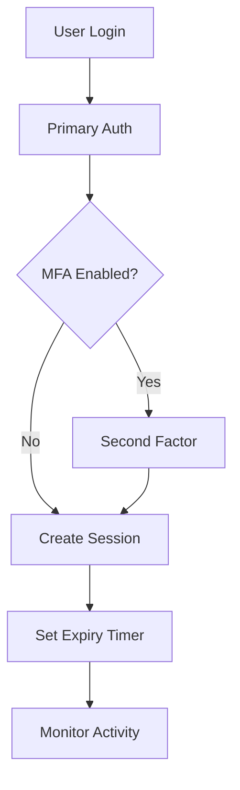

# Add Security to Your App

Your authentication works, now let's make it bulletproof. Enterprise applications need layers of security beyond basic login. This tutorial adds session management, multi-factor authentication, token validation, and secure deployment practices.

## Why Security Matters

Authentication vulnerabilities are expensive. A single compromised session can expose user data, trigger compliance violations, and damage your reputation.

**Security layers we'll add:**
- **Session expiry and rotation** - Automatic token refresh and timeout
- **Multi-factor authentication** - TOTP and SMS verification  
- **JWT validation** - Proper token verification on every request
- **HTTPS enforcement** - Encrypted data transmission


## Architecture Overview



<Info>Security is about **defense in depth** multiple layers working together to protect your users.</Info>

## Add Session Expiry

Sessions that never expire are security risks. Users might walk away from shared computers or lose devices. Automatic session expiry forces re-authentication after inactivity.

<CodeGroup>
```tsx SessionManager.tsx
import { useProtekt } from '@protekt/react';
import { useEffect, useState } from 'react';

export default function SessionManager({ children }) {
  const { user, refreshSession, logout } = useProtekt();
  const [sessionWarning, setSessionWarning] = useState(false);

  useEffect(() => {
    if (!user) return;

    const interval = setInterval(async () => {
      try {
        const sessionInfo = await refreshSession();
        const timeToExpiry = sessionInfo.expiresAt - Date.now();
        if (timeToExpiry < 5 * 60 * 1000) {
          setSessionWarning(true);
        }
      } catch (error) {
        logout();
      }
    }, 5 * 60 * 1000);

    return () => clearInterval(interval);
  }, [user]);

  return (
    <>
      {sessionWarning && (
        <div className="session-warning">
          Session expires soon. 
          <button onClick={() => refreshSession()}>Extend</button>
        </div>
      )}
      {children}
    </>
  );
}
```

```javascript session-config.js
const protekt = new Protekt({
  sessionConfig: {
    inactivityTimeout: 8 * 60 * 60 * 1000, // 8 hours
    absoluteTimeout: 24 * 60 * 60 * 1000,   // 24 hours
    refreshBuffer: 15 * 60 * 1000           // 15 minutes
  }
});

export const validateSession = async (req, res, next) => {
  try {
    const session = await protekt.getSession(req.headers.authorization);
    if (session.isExpired) {
      return res.status(401).json({ error: 'Session expired' });
    }
    req.user = session.user;
    next();
  } catch (error) {
    res.status(401).json({ error: 'Invalid session' });
  }
};
```
</CodeGroup>

<Warning>Never store session tokens in localStorage, use httpOnly cookies or secure sessionStorage.</Warning>

## Add MFA (Multi-Factor Authentication)

Multi-factor authentication adds a second verification step, making accounts nearly impossible to compromise even if passwords leak.

<CodeGroup>
```tsx MFASetup.tsx
import { useProtekt } from '@protekt/react';
import { useState } from 'react';

export default function MFASetup() {
  const { user, enableMFA, verifyMFA } = useProtekt();
  const [qrCode, setQrCode] = useState('');
  const [code, setCode] = useState('');
  const [step, setStep] = useState('setup');

  const handleEnableMFA = async () => {
    const { qrCodeUrl } = await enableMFA('totp');
    setQrCode(qrCodeUrl);
    setStep('verify');
  };

  const handleVerifyMFA = async () => {
    try {
      await verifyMFA(code);
      setStep('complete');
    } catch (error) {
      alert('Invalid code. Try again.');
    }
  };

  if (user?.mfaEnabled) {
    return <div> Multi-factor authentication enabled</div>;
  }

  return (
    <div className="mfa-setup">
      {step === 'setup' && (
        <div>
          <h3>Secure Your Account</h3>
          <button onClick={handleEnableMFA}>Enable 2FA</button>
        </div>
      )}
      {step === 'verify' && (
        <div>
          
          <input
            placeholder="6-digit code"
            value={code}
            onChange={(e) => setCode(e.target.value)}
          />
          <button onClick={handleVerifyMFA}>Verify</button>
        </div>
      )}
    </div>
  );
}
```

```javascript mfa-middleware.js
export const requireMFA = async (req, res, next) => {
  const user = req.user;
  
  if (!user.mfaEnabled) {
    return res.status(403).json({
      error: 'MFA required for this operation'
    });
  }

  const recentMFA = await protekt.checkRecentMFA(user.id, 10 * 60 * 1000);
  if (!recentMFA) {
    return res.status(403).json({
      error: 'MFA challenge required',
      challengeId: await protekt.createMFAChallenge(user.id)
    });
  }

  next();
};
```
</CodeGroup>

## Verify JWTs and Sessions

Every API request needs validation. Tokens can be forged, expired, or revoked. Proper verification checks signatures, expiration, and revocation status.

<CodeGroup>
```javascript jwt-validation.js
import { Protekt } from '@protekt/node';

const protekt = new Protekt({
  clientId: process.env.PROTEKT_CLIENT_ID,
  clientSecret: process.env.PROTEKT_CLIENT_SECRET
});

export const validateJWT = async (req, res, next) => {
  try {
    const authHeader = req.headers.authorization;
    if (!authHeader?.startsWith('Bearer ')) {
      return res.status(401).json({ error: 'Missing auth header' });
    }

    const token = authHeader.substring(7);
    const decoded = await protekt.verifyToken(token);
    
    const isRevoked = await protekt.isTokenRevoked(decoded.jti);
    if (isRevoked) {
      return res.status(401).json({ error: 'Token revoked' });
    }

    req.user = await protekt.getUser(decoded.sub);
    next();
  } catch (error) {
    res.status(401).json({ error: 'Invalid token' });
  }
};
```

```tsx TokenRefresh.tsx
import { useProtekt } from '@protekt/react';
import { useEffect } from 'react';

export default function TokenRefresh() {
  const { getAccessToken, refreshTokens, logout } = useProtekt();

  useEffect(() => {
    const refreshInterval = setInterval(async () => {
      try {
        const token = await getAccessToken();
        const payload = JSON.parse(atob(token.split('.')[1]));
        
        const expiresIn = payload.exp * 1000 - Date.now();
        if (expiresIn < 5 * 60 * 1000) {
          await refreshTokens();
        }
      } catch (error) {
        logout();
      }
    }, 60 * 1000);

    return () => clearInterval(refreshInterval);
  }, []);

  return null;
}
```
</CodeGroup>

## Enable HTTPS

HTTPS encrypts data between browsers and servers, preventing eavesdropping attacks. It's mandatory for production authentication systems.

<CodeGroup>
```javascript https-server.js
import express from 'express';

const app = express();

// Force HTTPS in production
if (process.env.NODE_ENV === 'production') {
  app.use((req, res, next) => {
    if (req.header('x-forwarded-proto') !== 'https') {
      res.redirect(`https://${req.header('host')}${req.url}`);
    } else {
      next();
    }
  });
}

// Security headers
app.use((req, res, next) => {
  res.setHeader('Strict-Transport-Security', 'max-age=31536000');
  res.setHeader('X-Content-Type-Options', 'nosniff');
  res.setHeader('X-Frame-Options', 'DENY');
  next();
});
```

```javascript secret-management.js
// ✅ Use environment variables
const protekt = new Protekt({
  clientId: process.env.PROTEKT_CLIENT_ID,
  clientSecret: process.env.PROTEKT_CLIENT_SECRET
});

// Validate required secrets at startup
function validateConfig() {
  const required = ['PROTEKT_CLIENT_ID', 'PROTEKT_CLIENT_SECRET'];
  for (const key of required) {
    if (!process.env[key]) {
      throw new Error(`Missing: ${key}`);
    }
  }
}
```
</CodeGroup>

<Tip>Use Let's Encrypt for free SSL certificates and update all OAuth redirect URLs to HTTPS.</Tip>

## Next Steps

You've built a security-hardened authentication system with session management, MFA, proper token validation, and HTTPS. Your application now meets enterprise security standards.

<CardGroup cols={2}>
<Card title="Mobile App Security" icon="mobile" href="/tutorials/mobile-app">
Extend security to iOS and Android
</Card>
<Card title="Enterprise SSO" icon="building" href="/tutorials/server-to-server">
Corporate identity integration
</Card>
<Card title="Advanced RBAC" icon="users-cog" href="/how-to-guides/setup-rbac">
Fine-grained permissions
</Card>
<Card title="Audit & Compliance" icon="clipboard-check" href="/security/best-practices">
SOC2, HIPAA, GDPR compliance
</Card>
</CardGroup>