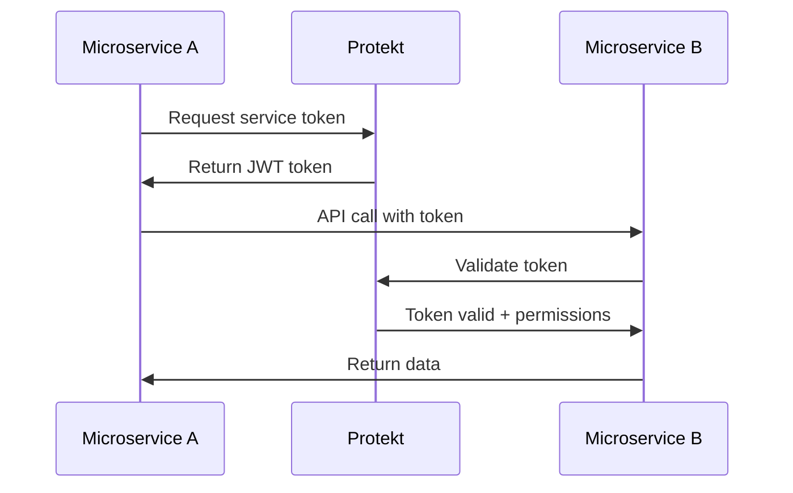

# Server-to-Server Auth

When your services need to talk to each other, they need secure authentication without human intervention. Server-to-server auth uses API keys and service tokens to verify system identity, enabling microservices, scheduled jobs, and third-party integrations.

## When to Use Server Auth

Server authentication solves different problems than user authentication. Users have browsers and can click buttons—servers need automated, reliable authentication that works 24/7.

**Common use cases:**
- **Microservice communication** - Order service calling payment service
- **Scheduled jobs** - Nightly data sync or backup processes
- **Webhook handlers** - Processing events from external APIs
- **CI/CD pipelines** - Deployment scripts accessing user data
- **Third-party integrations** - CRM systems syncing customer data



**Key differences from user auth:**
- No browser redirects or login forms
- Long-lived credentials with automatic rotation
- Fine-grained permissions per service
- Audit logging for compliance

<Info>Server tokens use **Client Credentials** OAuth flow—designed for machine-to-machine authentication.</Info>

## Generate API Keys and Service Tokens

Protekt provides two types of server credentials. API keys for simple authentication, service tokens for complex scenarios with expiration and rotation.

**API Keys**: Long-lived, simple strings perfect for webhooks and basic service communication. Think of them as server passwords that don't expire.

**Service Tokens**: Short-lived JWTs with automatic rotation, permissions, and audit trails. Best for microservices that need granular access control.

<CodeGroup>
```javascript generate-credentials.js
import { Protekt } from '@protekt/node';

const protekt = new Protekt({
  clientId: process.env.PROTEKT_CLIENT_ID,
  clientSecret: process.env.PROTEKT_CLIENT_SECRET
});

// Generate API key for webhook processing
async function createWebhookKey() {
  const apiKey = await protekt.createApiKey({
    name: 'Webhook Processor',
    permissions: ['webhooks:process', 'users:read'],
    environment: 'production'
  });
  
  console.log('API Key:', apiKey.key);
  console.log('Key ID:', apiKey.id);
  
  // Store securely - this is the only time you'll see the full key
  return apiKey;
}

// Generate service token for microservice
async function createServiceToken() {
  const token = await protekt.createServiceToken({
    serviceName: 'payment-processor',
    permissions: [
      'payments:create',
      'payments:read', 
      'users:read'
    ],
    scopes: ['org:123', 'environment:prod'],
    expiresIn: '30d'
  });
  
  return token;
}
```

```python service_auth.py
import os
from protekt import Protekt

protekt = Protekt(
    client_id=os.environ['PROTEKT_CLIENT_ID'],
    client_secret=os.environ['PROTEKT_CLIENT_SECRET']
)

def authenticate_service():
    """Get service token using client credentials flow"""
    try:
        token_response = protekt.get_service_token(
            scopes=['users:read', 'payments:write'],
            service_name='payment-service'
        )
        
        return {
            'access_token': token_response.access_token,
            'expires_at': token_response.expires_at,
            'permissions': token_response.permissions
        }
    except Exception as e:
        print(f'Service auth failed: {e}')
        raise

# Cache tokens and refresh before expiry
class ServiceTokenManager:
    def __init__(self):
        self._token = None
        self._expires_at = 0
    
    def get_valid_token(self):
        import time
        
        # Refresh if expired or expires within 5 minutes
        if not self._token or time.time() > (self._expires_at - 300):
            auth_data = authenticate_service()
            self._token = auth_data['access_token']
            self._expires_at = auth_data['expires_at']
        
        return self._token
```
</CodeGroup>

<Tip>Always set expiration dates on service credentials. Even server tokens should rotate regularly for security.</Tip>

## Authenticate Programmatically

Server authentication happens automatically in your code. Unlike users who click buttons, services authenticate by including credentials in HTTP headers or using OAuth flows.

<CodeGroup>
```javascript api-client.js
class ProtektApiClient {
  constructor(apiKey) {
    this.apiKey = apiKey;
    this.baseUrl = 'https://api.yourapp.com';
  }

  async makeAuthenticatedRequest(endpoint, options = {}) {
    const response = await fetch(`${this.baseUrl}${endpoint}`, {
      ...options,
      headers: {
        'Authorization': `Bearer ${this.apiKey}`,
        'Content-Type': 'application/json',
        'User-Agent': 'MyService/1.0',
        ...options.headers
      }
    });

    if (!response.ok) {
      if (response.status === 401) {
        throw new Error('Service authentication failed - check API key');
      }
      throw new Error(`API error: ${response.status}`);
    }

    return response.json();
  }

  // Example: Get user data from another service
  async getUser(userId) {
    return this.makeAuthenticatedRequest(`/api/users/${userId}`);
  }

  // Example: Process payment
  async createPayment(paymentData) {
    return this.makeAuthenticatedRequest('/api/payments', {
      method: 'POST',
      body: JSON.stringify(paymentData)
    });
  }
}

// Usage in microservice
const apiClient = new ProtektApiClient(process.env.PROTEKT_API_KEY);

export async function processOrder(orderId) {
  try {
    const user = await apiClient.getUser(order.userId);
    const payment = await apiClient.createPayment({
      amount: order.total,
      userId: user.id,
      orderId: orderId
    });
    
    return { success: true, paymentId: payment.id };
  } catch (error) {
    console.error('Order processing failed:', error);
    throw error;
  }
}
```

```go service_client.go
package main

import (
    "fmt"
    "net/http"
    "bytes"
    "encoding/json"
    "io"
    "os"
)

type ServiceClient struct {
    apiKey  string
    baseURL string
    client  *http.Client
}

func NewServiceClient() *ServiceClient {
    return &ServiceClient{
        apiKey:  os.Getenv("PROTEKT_API_KEY"),
        baseURL: "https://api.yourapp.com",
        client:  &http.Client{},
    }
}

func (s *ServiceClient) makeRequest(method, endpoint string, body interface{}) (*http.Response, error) {
    var bodyReader io.Reader
    
    if body != nil {
        jsonBody, err := json.Marshal(body)
        if err != nil {
            return nil, err
        }
        bodyReader = bytes.NewBuffer(jsonBody)
    }

    req, err := http.NewRequest(method, s.baseURL+endpoint, bodyReader)
    if err != nil {
        return nil, err
    }

    req.Header.Set("Authorization", "Bearer "+s.apiKey)
    req.Header.Set("Content-Type", "application/json")
    req.Header.Set("User-Agent", "GoService/1.0")

    resp, err := s.client.Do(req)
    if err != nil {
        return nil, err
    }

    if resp.StatusCode == 401 {
        return nil, fmt.Errorf("authentication failed - check API key")
    }

    return resp, nil
}

func (s *ServiceClient) GetUser(userID string) (map[string]interface{}, error) {
    resp, err := s.makeRequest("GET", "/api/users/"+userID, nil)
    if err != nil {
        return nil, err
    }
    defer resp.Body.Close()

    var user map[string]interface{}
    err = json.NewDecoder(resp.Body).Decode(&user)
    return user, err
}
```
</CodeGroup>

## Token Scope and Expiry

Service tokens should follow the principle of least privilege. Each service gets only the permissions it needs, with automatic expiration to limit damage from compromised credentials.

**Scoping strategies:**
- **By service function**: Payment service gets payment permissions only
- **By environment**: Production services can't access development data
- **By organization**: Multi-tenant services are isolated per customer
- **By time**: Scheduled jobs get short-lived tokens

<CodeGroup>
```javascript token-management.js
class TokenManager {
  constructor() {
    this.tokens = new Map();
  }

  async getToken(serviceName, requiredScopes) {
    const tokenKey = `${serviceName}:${requiredScopes.sort().join(',')}`;
    let tokenData = this.tokens.get(tokenKey);

    // Check if token exists and isn't expiring soon (5 min buffer)
    if (tokenData && tokenData.expiresAt > Date.now() + (5 * 60 * 1000)) {
      return tokenData.token;
    }

    // Request new token with specific scopes
    try {
      const response = await protekt.getServiceToken({
        serviceName,
        scopes: requiredScopes,
        expiresIn: '1h'  // Short-lived for security
      });

      this.tokens.set(tokenKey, {
        token: response.accessToken,
        expiresAt: response.expiresAt
      });

      return response.accessToken;
    } catch (error) {
      console.error(`Failed to get token for ${serviceName}:`, error);
      throw error;
    }
  }

  // Clean up expired tokens
  cleanupExpiredTokens() {
    const now = Date.now();
    for (const [key, tokenData] of this.tokens.entries()) {
      if (tokenData.expiresAt <= now) {
        this.tokens.delete(key);
      }
    }
  }
}

const tokenManager = new TokenManager();

// Example: Get scoped token for specific operation
export async function syncUserData(userId) {
  const token = await tokenManager.getToken('user-sync-service', [
    'users:read',
    'profiles:write',
    'audit:write'
  ]);

  // Use token for API calls...
}
```

```yaml service-permissions.yml
# Example service permission configuration
services:
  payment-processor:
    permissions:
      - payments:create
      - payments:read
      - payments:update
      - users:read  # Only read access to user data
    scopes:
      - org:production
      - environment:prod
    token_lifetime: 1h

  user-sync-service:
    permissions:
      - users:read
      - users:write
      - profiles:sync
    scopes:
      - org:all
      - environment:staging,prod
    token_lifetime: 30m

  webhook-processor:
    permissions:
      - webhooks:process
      - events:write
      - notifications:send
    scopes:
      - environment:prod
    token_lifetime: 24h  # Longer for reliability
```
</CodeGroup>

<Warning>Never give services admin permissions unless absolutely necessary. Use specific permissions like `users:read` instead of `admin:all`.</Warning>

## Audit and Logging

Server-to-server authentication generates significant audit trails. Track which services access what data, when, and why. This visibility is crucial for security monitoring and compliance.

<CodeGroup>
```javascript audit-middleware.js
export function auditMiddleware(req, res, next) {
  const startTime = Date.now();
  
  // Extract service info from token
  const serviceId = req.user?.serviceId || 'unknown';
  const serviceName = req.user?.serviceName || 'unnamed-service';
  
  // Log request start
  console.log({
    event: 'service_request_start',
    serviceId,
    serviceName,
    method: req.method,
    path: req.path,
    userAgent: req.get('User-Agent'),
    timestamp: new Date().toISOString(),
    requestId: req.id
  });

  // Capture response details
  res.on('finish', () => {
    const duration = Date.now() - startTime;
    
    console.log({
      event: 'service_request_complete',
      serviceId,
      serviceName,
      method: req.method,
      path: req.path,
      statusCode: res.statusCode,
      duration,
      timestamp: new Date().toISOString(),
      requestId: req.id
    });
  });

  next();
}

// Apply to all service routes
app.use('/api', protekt.requireServiceAuth, auditMiddleware);
```

```python audit_logger.py
import time
import json
import logging
from functools import wraps

# Configure structured logging
logging.basicConfig(
    level=logging.INFO,
    format='%(message)s'
)
logger = logging.getLogger(__name__)

def audit_service_call(operation_name):
    """Decorator to audit service-to-service API calls"""
    def decorator(func):
        @wraps(func)
        def wrapper(*args, **kwargs):
            start_time = time.time()
            service_context = getattr(wrapper, '_service_context', {})
            
            # Log operation start
            audit_data = {
                'event': 'service_operation_start',
                'operation': operation_name,
                'service_id': service_context.get('service_id'),
                'service_name': service_context.get('service_name'),
                'timestamp': time.time(),
                'args_count': len(args),
                'kwargs_keys': list(kwargs.keys())
            }
            logger.info(json.dumps(audit_data))
            
            try:
                result = func(*args, **kwargs)
                
                # Log successful completion
                audit_data.update({
                    'event': 'service_operation_complete',
                    'duration': time.time() - start_time,
                    'status': 'success'
                })
                logger.info(json.dumps(audit_data))
                
                return result
                
            except Exception as e:
                # Log error
                audit_data.update({
                    'event': 'service_operation_error',
                    'duration': time.time() - start_time,
                    'error': str(e),
                    'status': 'error'
                })
                logger.error(json.dumps(audit_data))
                raise
                
        return wrapper
    return decorator

# Usage example
@audit_service_call('process_payment')
def process_payment(user_id, amount):
    # Payment processing logic
    pass
```
</CodeGroup>

## Rate Limits and Safety

Services can make requests much faster than humans. Without rate limiting, a misconfigured service can overwhelm your API. Implement both per-service and global rate limits.

**Rate limiting strategies:**
- **Per-service limits**: Each service gets a quota
- **Burst allowances**: Handle traffic spikes gracefully  
- **Priority queuing**: Critical services get higher limits
- **Circuit breakers**: Stop cascading failures

<Tip>Start with generous rate limits and tighten based on actual usage patterns. Monitor service behavior before restricting access.</Tip>

## Next Steps

You've built secure server-to-server authentication with proper token management, audit logging, and rate limiting. Your services can now communicate securely while maintaining compliance and observability.

<CardGroup cols={2}>
<Card title="B2B Organizations" icon="building" href="/tutorials/b2b-organizations">
Multi-tenant service authentication
</Card>
<Card title="Security Best Practices" icon="shield" href="/security/best-practices">
Advanced service security patterns
</Card>
<Card title="API Reference" icon="code" href="/reference/api-overview">
Complete server auth API documentation
</Card>
<Card title="Monitoring & Alerts" icon="chart-line" href="/how-to-guides/monitoring">
Service authentication monitoring
</Card>
</CardGroup>